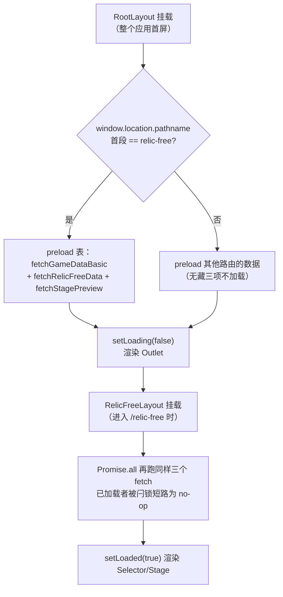
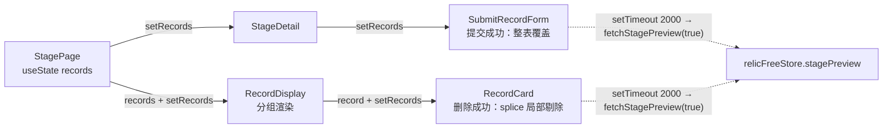

# 01 架构与数据流总览

本文回答一个问题：**无藏收录（`/relic-free`）从路由进入到记录上屏，数据经过了哪些环节、每个环节归谁管。**

先说三个事关全局的事实，避免被类型定义和直觉误导：

- **`/relic-free/bundle` 只下发 `character_basic` 与 `stageEnemies` 两项**。后端中间件链是 `getCharBasic → getStageEnemies → sendBundle`（arkrog_backend/routers/relic-free.js）；`stagePreview` 只经 `GET /relic-free/stage-preview` 单独下发；`uniequip_basic` 后端**从不下发**，由前端 `relicFreeStore` 的 `fetchRelicFreeData` 从 `character_basic` 摊平派生（见 [第 4 节](#4-relic-free-端点与缓存不对称)）。前端 `RelicFreeBasic` 类型里四个字段齐全，不代表 bundle 里四个字段齐全。
- **记录列表刻意不进任何 store**。关卡页记录数据是局部 `useState`，靠 `setRecords` prop 链贯穿提交/删除（见 [第 5 节](#5-记录列表局部-state--setrecords-prop-链)）。
- **所有 store 的 fetch 动作在内部吞掉错误**（toast 后不再抛出），因此加载失败不会中断 `Promise.all`，而是以"数据缺失 + 页面照常渲染"的形式延迟暴露为白屏或无限 Loading（见 [第 6 节](#6-静默失败模式)）。

> 路径约定：本文中 `Selector/...`、`Stage/...` 相对于模块根 `app/modules/RelicFree/`；`app/...` 开头相对于前端仓库根；`arkrog_backend/...` 指后端仓库。引用代码一律"路径 + 导出符号"。

## 1. 路由与页面组件树

路由注册在 `app/routes.ts` 的默认导出：`/relic-free` 挂 `app/routes/RelicFreeLayout.tsx`，其下 index 为选择页、`:stageId` 为关卡页。

```
RootLayout (app/routes/RootLayout.tsx，首屏 preload + 全局弹窗)
└─ RelicFreeLayout (app/routes/RelicFreeLayout.tsx，兜底加载 + loaded 闩锁)
   ├─ index → StageSelector (Selector/index.tsx)          ← 关卡选择页
   │   ├─ SelectorBanner (Selector/SelectorBanner.tsx)     主题切换导航 + topic_banner 横幅
   │   └─ SelectorDetail (Selector/SelectorDetail.tsx)     层数筛选器 + 关卡卡片墙（stagePreview 徽标）
   └─ :stageId → StagePage (Stage/index.tsx)               ← 关卡详情页
       ├─ StageDetail (Stage/StageDetail.tsx)              面包屑/上一关下一关/地图/敌方情报
       │   └─ SubmitRecordForm (Stage/SubmitRecordForm.tsx) 提交记录（level>=3 才渲染）
       └─ RecordDisplay (app/modules/RecordDisplay/index.tsx，isStagePage=true)
           └─ RecordCard (app/components/RecordCard/RecordCard.tsx)
```

`RecordDisplay`/`RecordCard` 是被首页与收藏页复用的共享组件，其契约单独成篇：[04-record-card-and-display.md](04-record-card-and-display.md)。

### 1.1 路由参数契约

| 参数 | 位置 | 消费方 | 语义与兜底 |
|---|---|---|---|
| `topicId` | query（`/relic-free?topicId=rogue_4`） | `Selector/index.tsx` 的 `StageSelector` | 值为 `RogueKey`；缺失或非法时兜底为 `Object.values(topics).slice(-1)[0]`，即 **topics 对象的最后一个键 = 最新主题**（又一处依赖后端键序，见 6.1） |
| `zoneId` | query | 同上 → `SelectorDetail` | 值为 `app/utils/stageSelector.ts` 的 `navOfZone` 中某项 `id` 或 `all`；缺失兜底 `all`。`SelectorBanner` 切换主题时会 `searchParams.delete("zoneId")` 重置层数筛选 |
| `stageId` | path（`/relic-free/:stageId`） | `Stage/index.tsx` 的 `StagePage` | 按 `_` 切分至少三段（`ro1_b_1`），否则渲染"非法的关卡名称"；主题键由 `"rogue_" + ro.slice(-1)` 推导——**该写法在 ro10 会产出 `rogue_0`**，全仓分布见 [generated/hardcode-snapshot.md](generated/hardcode-snapshot.md)，语法权威见 [03-stage-taxonomy-and-selector.md](03-stage-taxonomy-and-selector.md) |

### 1.2 sessionStorage `relicFreeReturnUrl`：一次性返回契约

- **写入**：`SelectorDetail` 中点击关卡卡片时，把当前 `topicId`/`zoneId` 组装为 `/relic-free?...` 存入 `sessionStorage.relicFreeReturnUrl`，随后 `navigate(stage.id)`。
- **消费**：`StageDetail` 的 `handleBack`（返回按钮）读取后**立即 `removeItem` 再跳转**——一次性消费，防止污染后续导航；无存值时兜底 `navigate(-1)`。
- 注意"上一关/下一关"按钮**不重写**该键：连续翻关后点返回，回到的仍是最初进入详情页时的筛选状态。

## 2. 四个 store 的分工与端点映射

四个 zustand store 服务本模块，职责互不重叠：

| store | 文件 | 持有数据 | 动作 → 端点 | 刷新能力 |
|---|---|---|---|---|
| relicFreeStore | `app/stores/relicFreeStore.ts` | `character_basic`、`uniequip_basic`（前端派生）、`stagePreview`、`stageEnemies` | `fetchRelicFreeData` → `GET /relic-free/bundle`；`fetchStagePreview(force?)` → `GET /relic-free/stage-preview` | `relicFreeDataLoaded`/`stagePreviewLoaded` 闩锁；**仅 `fetchStagePreview(true)` 可强刷** |
| gameDataStore | `app/stores/gameDataStore.ts` | `topics`/`zones`/`stages`（选择页与关卡反查全靠它） | `fetchGameDataBasic` → `GET /gamedata/bundle` | `basicLoaded` 闩锁，无强刷。无藏页面不需要 `bundle-ext` |
| appDataStore | `app/stores/appDataStore.ts` | `recommendRecordIds`/`latestRecordIds`/`charImages`/`inclusionPrinciple` 等首页数据 | `fetchAppData` → `GET /app/bundle` | `appDataLoaded` 闩锁，无强刷。消费方是首页 `IndexRelicFree` 与 `RecordCard` 背景立绘 |
| recordStore | `app/stores/recordStore.tsx` | 仅 `activeRecord` 一条 | **无端点**。纯 UI 状态：`RecordCard` 举报按钮 `setActiveRecord` → `ReportModal` 读取 | `clearActiveRecord` 存在但全仓零调用 |

记录列表本身不在上表任何 store 里（见第 5 节）。此外 `userInfoStore`（`app/stores/userInfoStore.ts` 的 `useUserInfoStore`）为提交/删除/收藏提供 `userInfo.level` 软守卫，等级语义以 arkrog_backend/docs/Permission.md 为权威（0=VISITOR ~ 6=ROOT），全站权限机制见 [docs/auth-and-permissions.md](../../../../docs/auth-and-permissions.md)。

页面组件直接发起、不经 store 的请求（完整对照以 [generated/api-endpoints.md](generated/api-endpoints.md) 为准）：

| 调用点 | 端点 | 用途 |
|---|---|---|
| `Stage/index.tsx` 的 `StagePage` | `POST /record` | 按 `stageId` 拉取关卡记录列表（进局部 state） |
| `Stage/SubmitRecordForm.tsx` 的 `handleSubmit` | `POST /record/submit` | 提交记录，响应为**该关全量记录列表**，直接 `setRecords` 覆盖 |
| `RecordCard` | `POST /record/delete`、`POST /user/favorite` | 删除 / 收藏，见 [04-record-card-and-display.md](04-record-card-and-display.md) |
| `ReportModal` | `POST /user/feedback` | 举报（当前为写入即黑洞，见 [known-issues.md](known-issues.md)） |
| `IndexRelicFree`、`Home/Favorite` | `POST /record/ids` | 按 id 批量取记录 |

所有请求经 `app/utils/tools.ts` 的 `_get`/`_post`：拼接 `VITE_API_BASE_URL` 前缀、携带 cookie（`credentials: "include"`）、非 2xx 时以响应文本为 message 抛 `Error`。

## 3. 双保险加载与 loaded 闩锁

数据预加载有两道相互冗余的入口，靠 store 闩锁避免重复请求：



- **第一道**：`RootLayout`（`app/routes/RootLayout.tsx`）挂载时按 `window.location.pathname` 首段查 preload 表——只对**冷启动的首个 URL** 生效，且整个应用在 `fetchUserInfo` + preload 完成前渲染全局 `Loading`。
- **第二道**：`RelicFreeLayout`（`app/routes/RelicFreeLayout.tsx`）挂载时无条件 `Promise.all` 同样三个 fetch，覆盖"从其他页面 SPA 切换进无藏"的场景（此时第一道没跑过无藏项）。局部 `loaded` state 在完成前渲染 `Loading`。
- **闩锁语义**：`fetchRelicFreeData`/`fetchGameDataBasic`/`fetchAppData` 首行检查 `*Loaded` 即 return——**会话内不可刷新**，改数据后想看到效果只能整页刷新。唯一例外是 `fetchStagePreview(force = true)`，被提交/删除后的 2 秒 `setTimeout` 使用（时序契约背景见本模块 adr/ 目录 0006；该刷新依赖后端 `stagePreviewSingleUpdate` 增量重算，其断裂与修复状态见 [known-issues.md](known-issues.md) 与 [06-data-pipeline.md](06-data-pipeline.md)）。

## 4. /relic-free 端点与缓存不对称

后端 arkrog_backend/routers/relic-free.js 注册四个 GET 端点，处理器复用同一批中间件函数：

| 端点 | 处理链 | 缓存头 | 前端调用点 |
|---|---|---|---|
| `/relic-free/bundle` | `strongCacheMiddleware(86400)` → 初始化 `req.requestBundle` → `getCharBasic` → `getStageEnemies` → `sendBundle` | **24h 强缓存** | `fetchRelicFreeData` |
| `/relic-free/stage-preview` | `getStagePreview` 单独响应 | **无缓存头** | `fetchStagePreview` |
| `/relic-free/character-basic`、`/relic-free/stage-enemies` | 各自单独响应 | 无 | **前端零调用**（bundle 的拆分件，仅供独立访问） |

不对称是**刻意设计**而非疏漏（取舍记录见本模块 adr/ 目录 0003）：

- `character_basic`/`stageEnemies` 是游戏版本数据，更新频率以周计，强缓存换加载速度；
- `stagePreview` 是**唯一混入用户数据的产物**（每条记录的提交/删除都可能改变"最少人数"徽标），必须可即时刷新——`fetchStagePreview(true)` 的 2 秒强刷正是靠"无缓存头"才有意义。若给它加上强缓存，提交后徽标将 24 小时不动。

`uniequip_basic` 的派生发生在 `fetchRelicFreeData` 内：遍历 `character_basic` 每个干员的 `uniequip` 字段摊平成 `Record<uniEquipId, UniEquipBasicData>`，供 `SubmitRecordForm` 的模组选择与 `CharAvatar` 的模组角标使用。后端没有对应端点，**排查模组数据问题应查 `character_basic` 的生成链**（[06-data-pipeline.md](06-data-pipeline.md)）。

## 5. 记录列表：局部 state + setRecords prop 链

关卡页记录列表**刻意不进 store**（背景见本模块 adr/ 目录 0002）：`Stage/index.tsx` 的 `StagePage` 持有 `useState<RecordType[]>`，读写沿 prop 链分发：



- 拉取：`StagePage` 的 `useEffect` 以 `POST /record` 拉当前关记录，成功后 `setRecordsLoaded(true)`。
- 提交：`POST /record/submit` 的响应是该关**全量列表**，`SubmitRecordForm` 直接 `setRecords(records)` 覆盖。
- 删除：`RecordCard` 的 `handleDeleteRecord` 在本地 `splice` 剔除（`setRecords` 为可选 prop，未传时 UI 不动，见 [04-record-card-and-display.md](04-record-card-and-display.md)）。
- 副作用：提交/删除各自在 2 秒后 `fetchStagePreview(true)`，让选择页徽标跟上——记录列表与预览徽标走**两条独立数据通道**，前者 prop 链、后者 store。

含义：切出关卡页记录列表即销毁，重进重新拉取；不同关卡之间无共享缓存。记录 schema 与生命周期正文见 [02-record-lifecycle-and-schema.md](02-record-lifecycle-and-schema.md)。

## 6. 隐式契约与静默失败模式

### 6.1 上一关/下一关依赖 `Object.keys(stagePreview!)` 键序

`StageDetail` 中：

```
const stageIds = Object.keys(stagePreview!);
const prevStageIdx = stageIds.indexOf(stageData.id) - 1;
const nextStageIdx = stageIds.indexOf(stageData.id) + 1;
```

翻关顺序 = **后端生成 `stagePreview` JSON 时的键插入顺序**。这是一条跨仓库隐式契约：后端全量重算（`buildPreloadData`）按关卡表顺序写键，顺序才有意义；任何"增量更新导致键挪到末尾"或"重建时乱序"都会直接打乱前端翻关，且无任何报错。选择页 `topicId` 兜底取 `topics` 最后一个键（1.1 节）是同款依赖。生成侧细节见 [06-data-pipeline.md](06-data-pipeline.md)。

同一行的 `stagePreview!` 非空断言意味着 `fetchStagePreview` 失败（或后端该文档缺失）时关卡页**必然 TypeError 崩溃**，已登记于 [known-issues.md](known-issues.md)。

### 6.2 静默失败矩阵

所有 fetch 动作 `catch` 后只 toast 不再抛，`Promise.all` 照常 resolve、`loaded` 照常置 true，于是失败以下游形态出现：

| 失败点 | 数据形态 | 用户可见表现 |
|---|---|---|
| `fetchGameDataBasic` 失败 | `topics`/`stages` 为 `undefined` | `StageSelector` 的 `useMemo` 读 `topics[...]` 抛 TypeError → `app/root.tsx` 的 `ErrorBoundary` 兜底页（"应用遇到了一些问题"） |
| `fetchRelicFreeData` 失败 | `character_basic`/`stageEnemies` 为 `undefined` | 提交表单无法解析队伍、敌方情报为空；无崩溃，功能静默残缺 |
| `fetchStagePreview` 失败 | `stagePreview` 为 `undefined` | 选择页徽标全部消失（`stagePreview?.` 可选链安全）；**关卡页崩溃**（6.1 的非空断言） |
| `StagePage` 的 `POST /record` 失败 | `recordsLoaded` 恒 false | toast 一次后**无限 Loading**，无重试机制 |

排查这类"看起来没加载"的问题时，先开 devtools 看 network 与 zustand devtools（各 store 均挂了 `devtools` 中间件），再对照本表定位断在哪一层。
