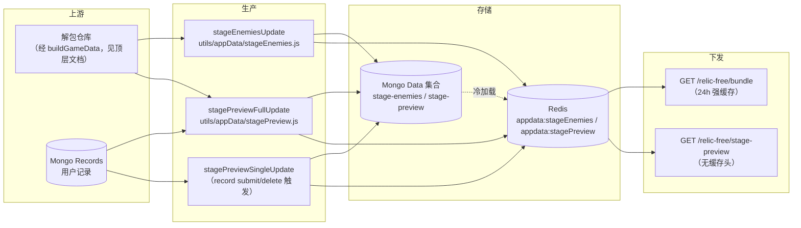

# 无藏专有数据链路

本篇是无藏收录模块**专有**数据链路的正文：`/relic-free` 端点族、`stage-preview` / `stage-enemies` 两份派生数据的生产、存储、缓存与下发。与全站共享的段落——解包仓库 → `buildGameData` → Mongo `GameData` 集合、`dataCacheManager` 的四类缓存前缀与降级策略、HTTP 强缓存/ETag 机制、`updateGameData.ts` 的完整七步——正文在顶层[数据管线文档](../../../../docs/data-pipeline.md)，本篇只链接不复制。

前端各 store 的加载时序（RootLayout 预载 + RelicFreeLayout 兜底）见 [01-architecture-and-data-flow.md](./01-architecture-and-data-flow.md)；记录（Records）本身的提交/删除契约见 [02-record-lifecycle-and-schema.md](./02-record-lifecycle-and-schema.md)；stage id 语法与 `skipStage` 收录规则的权威文档是 [03-stage-taxonomy-and-selector.md](./03-stage-taxonomy-and-selector.md)。

## 1. 端点总表与缓存策略差异

无藏页面运转依赖四路数据端点，缓存策略刻意不对称：

| 端点 | 下发内容 | Cache-Control | 前端消费方 |
|---|---|---|---|
| `GET /gamedata/bundle` | `topics` + `zones` + `stages`（关卡结构） | `strongCacheMiddleware(86400)`，24 小时强缓存 | `app/stores/gameDataStore.ts` 的 `fetchGameDataBasic`（与计算器等共用，正文见[顶层数据管线](../../../../docs/data-pipeline.md)） |
| `GET /relic-free/bundle` | `character_basic` + `stageEnemies` | `strongCacheMiddleware(86400)`，24 小时强缓存 | `app/stores/relicFreeStore.ts` 的 `fetchRelicFreeData` |
| `GET /relic-free/stage-preview` | `stagePreview`（记录派生的关卡预览） | **无缓存头**（不经 `strongCacheMiddleware`，仅 Express 默认弱 ETag，浏览器每次回源） | `app/stores/relicFreeStore.ts` 的 `fetchStagePreview` |
| `GET /app/bundle` | `inclusionPrinciple`（收录原则）、`recommendRecordIds`、`latestRecordIds`、`recommendArticles`、`charImages`、`banners` | `strongCacheMiddleware(3600)`，1 小时强缓存 | `app/stores/appDataStore.ts`（收录原则弹窗、首页无藏记录卡、RecordCard 背景立绘） |

缓存头由 `arkrog_backend/middleware/optimization.js` 的 `strongCacheMiddleware` 统一下发（含内容哈希 ETag 与 304、请求头带 `Cache-Control: no-cache` 时整体跳过），机制细节见顶层数据管线文档第 2.3 节。

**不对称是设计而非疏漏**：`character_basic`/`stageEnemies` 只随游戏版本变化，可以强缓存一天；`stagePreview` 混入用户记录（见第 5 节），提交/删除记录后前端要在 2 秒后强刷它（[02](./02-record-lifecycle-and-schema.md) 的时序契约），因此不能有强缓存。副作用是：**记录相关的"最少人数"即时可见，而敌人列表/干员数据的更新对普通用户最长延迟一天**（运维侧应对见 [07-ops-runbook.md](./07-ops-runbook.md)）。

### 1.1 /relic-free/bundle 的实际组成

`arkrog_backend/routers/relic-free.js` 中 `/bundle` 的中间件链为：初始化 `req.requestBundle` → `getCharBasic` → `getStageEnemies` → `sendBundle`。因此 bundle **只下发两个字段**：

- `character_basic`：`dataCacheManager.getOrLoadGameData("character-basic")`（Mongo `GameData` 集合文档，来自 `buildGameData`）；
- `stageEnemies`：`dataCacheManager.getOrLoadAppData("stageEnemies")`（本篇第 6 节）。

注意两件容易写错的事：

1. **`stagePreview` 不在 bundle 里**。`getStagePreview` 处理器虽然写了 `req.requestBundle` 分支、具备进 bundle 的能力，但 `/bundle` 的中间件链没有挂它——它只经独立端点 `GET /relic-free/stage-preview` 下发（原因即上文缓存不对称）。
2. **`uniequip_basic` 后端从不下发**。前端 `app/stores/relicFreeStore.ts` 的 `fetchRelicFreeData` 收到 bundle 后，遍历 `character_basic` 每个干员的 `uniequip` 字段摊平成 `uniequip_basic` 平面表——这是前端派生数据，后端没有对应端点或字段。

### 1.2 无调用方的独立端点

`routers/relic-free.js` 还注册了 `GET /relic-free/character-basic` 与 `GET /relic-free/stage-enemies` 两个独立端点（同一处理器的非 bundle 分支；前者包一层 `{ character_basic }`，后者直接送原始对象）。**当前前端零调用方**：全前端对 `/relic-free/` 的请求只有 `/relic-free/bundle` 与 `/relic-free/stage-preview` 两处（均在 `relicFreeStore`）。这两个端点是 bundle 模式的副产物，仅可作调试用途；且它们不经 `strongCacheMiddleware`，无缓存头。端点-调用点对照以生成物 [generated/api-endpoints.md](./generated/api-endpoints.md) 为准。

## 2. 存储层：Mongo Data 两文档 + Redis appdata:* 键

### 2.1 Mongo

无藏专有的两份派生数据落在 **`Data` 集合**（不是 `GameData` 集合），文档形如 `{ name, data }`：

| 文档 name | 内容 | 生产者 |
|---|---|---|
| `stage-preview` | `Record<stageId, StagePreviewData>`（第 4 节） | `stagePreviewFullUpdate` / `stagePreviewSingleUpdate`（`utils/appData/stagePreview.js`） |
| `stage-enemies` | `Record<stageId, string[]>`（敌人名称列表） | `stageEnemiesUpdate`（`utils/appData/stageEnemies.js`） |

`Data` 集合里还有 `banners`、`inclusion-principle` 等非无藏专有文档（经 `/app/bundle` 下发），以及四个不落库的特殊键（`charImages`/`recommendRecordIds`/`latestRecordIds`/`recommendArticles`，见 `utils/appData/db.js` 的 `getAppDataKeys`）。

### 2.2 Redis 键与 kebab/camel 折叠

`utils/dataCache.js` 的 `dataCacheManager`（文件头 130 行 JSDoc 是其契约底稿）把 AppData 缓存为 `appdata:{camelCase}` 永久键：

- 读键构建：`getOrLoadAppData(key)` 内部用 `utils/helper.js` 的 `kebabToCamel` 折叠，所以 `"stagePreview"` 与 `"stage-preview"` 都落到同一个 Redis 键 `appdata:stagePreview`；
- 冷加载回查：缓存未命中时 `utils/appData/db.js` 的 `loadAppDataFromSource` 用 `camelToKebab` 把 camelCase 键折回 kebab-case 去查 `Data` 集合（`stagePreview` → `stage-preview`），查不到再按原键重试；
- 实际 Redis 键还带客户端级前缀 `REDIS_PREFIX`（默认 `arkrog`，见 `database/redis.js` 的 `redisConnect`），即 `arkrog:appdata:stagePreview`。

写路径由 `dataCacheManager.set`（790afd6 补回的公有方法，Redis 优先、失败降级内存并在成功时清内存旧值）承担；`persistStagePreview`/`persistStageEnemies` 先 `set` 缓存、再 upsert Mongo。Redis 不可用时的整体降级策略见顶层数据管线文档与 `dataCache.js` 文件头 JSDoc。

## 3. stage-preview 的双生产路径

### 3.1 增量：记录提交/删除触发，fire-and-forget

`arkrog_backend/routers/record.js` 的 `POST /record/submit` 与 `POST /record/delete` 在落库/删除之后调用 `stagePreviewSingleUpdate(stageId)`，且**不 await**、只挂 `.catch(console.error)`——失败不影响接口响应，仅留一行服务端日志。前端的配合契约是提交/删除成功后 `setTimeout` 2 秒再 `fetchStagePreview(true)` 强刷（`app/modules/RelicFree/Stage/SubmitRecordForm.tsx` 与 `app/components/RecordCard/RecordCard.tsx`，详见 [02](./02-record-lifecycle-and-schema.md)）。

`stagePreviewSingleUpdate`（`utils/appData/stagePreview.js`）现行行为：

1. `getOrLoadAppData("stagePreview")` 读取现值——Redis 未命中时从 `Data` 集合冷加载，避免以空对象起步覆盖其他关卡（极端情况下 Mongo 也无该文档时仍会以 `{}` 起步，产出只含单关的 preview）；
2. 查询该 `stageId` 的全部 Records（投影 `team`/`type`/`level`），按第 4 节口径重算三种作战类型的最少人数；
3. 用 `buildPreloadData(stageId)` 重建面包屑等预载数据后合并写回（`{ ...buildPreloadData(stageId), ...stageData }`），与全量更新语义对齐；
4. `persistStagePreview`：写 Redis 缓存 + upsert Mongo。

注意增量路径**不做 `skipStage` 过滤**：对任意传入的 `stageId` 都会计算并写入一个条目，"只收录第 4 层起"的约束靠提交入口的软限制维持（见 [02](./02-record-lifecycle-and-schema.md)、[03](./03-stage-taxonomy-and-selector.md)）。

### 3.2 全量：admin 端点 / 离线脚本

全量重算入口 `stagePreviewFullUpdate`（同文件）：从 `getOrLoadGameData("stages")` 遍历全部主题全部关卡，经 `utils/appData/shared.js` 的 `skipStage` 过滤（普通关前 3 层、boss 关三层 boss 不收录），对每关按全量 Records 重算并重建面包屑，最后 `persistStagePreview` 整体替换。触发方式有三：

1. `POST /admin/calculate-stage-preview`（`routers/admin.js`，Level 4+，curl 示例见 [07](./07-ops-runbook.md)）；
2. `util-scripts/updateGameData.ts` 的**第 6 步**（可 `--skip-preview` 跳过，理由见第 5 节）；
3. 直接执行 `utils/appData/stagePreview.js`（文件尾部的直执守卫经 `initDatabaseForScript` 起库连接）。

### 3.3 修复历史与生产部署状态

> ⚠️ **写路径断裂存在于 fc2f75f ~ 790afd6 区间；生产已于 2026-07-18 部署修复并完成回填。**
>
> - fc2f75f（2025-11-14，缓存迁移 Redis 的重构）删除了 `dataCacheManager` 的公有 `get`/`set` 后未迁移全部调用点，此后区间内：增量/全量重算在持久化一步 100% TypeError（增量的错误被 `.catch(console.error)` 吞掉）、`stageEnemies.js` 因从已迁移的旧位置 import `processLevelData` 而使 `updateGameData.ts` 无法启动，另有 async 未 await、`camelToKebab` 被当映射表下标访问两处隐藏层断裂。
> - 790afd6（2026-07-13，本地 HEAD 已含）修复：`DataCacheManager` 补公有 `set`；`stagePreviewSingleUpdate` 改用 `getOrLoadAppData` 读取且单关更新时重建面包屑；`stageEnemies.js` 改从 `#utils/gamedata/level.js` 导入 `processLevelData` 并补 await；`loadAppDataFromSource` 修复 `camelToKebab` 下标误用。本篇第 3.1/3.2/6 节均按修复后的现行代码描述。
> - 生产后端已于 2026-07-18 部署至 `65961b7`，随后完整执行 `yarn update-data:prod --yes`：`stage-preview` 与 `stage-enemies` 已重建并写入 Mongo/Redis；验证得到 70 条 `ro6` preview 与 70 条 `ro6` stageEnemies。历史部署与回填顺序仍见 [07-ops-runbook.md](./07-ops-runbook.md)；缺陷销项见 [known-issues.md](./known-issues.md)。

## 4. StagePreviewData 字段语义

前端类型是 `app/types/gameData.ts` 的 `StagePreviewData`（整表 `StagePreview = Record<stageId, StagePreviewData>`）：

| 字段 | 语义 | 生产逻辑 |
|---|---|---|
| `normalNum` / `eliteNum` / `boatNum` | 该关对应作战类型（普通/紧急/带船，见 [03](./03-stage-taxonomy-and-selector.md) 与[术语表](../../../../docs/glossary.md)）在**最高已有记录难度下的最少人数** | `calculateOptimalNum`：按 `["N0","N15","N18"]` 顺序逐难度取该难度记录的最小 `team.length`（reduce 初值 14），**仅当结果 < 14 才写入**，较高难度覆盖较低难度。没有任何记录的类型不产生字段（前端按 `undefined` 处理为无徽标） |
| `normalLevel` / `eliteLevel` / `boatLevel` | 上述人数对应的难度（`"N0"`/`"N15"`/`"N18"`） | 与 Num 同步写入 |
| `breadcrumb` | 关卡页面包屑文案，如 `// 第 5 层 // 异格三结局` | `buildPreloadData` 按 stage id 分段推导：boss 关由 `shared.js` 三张 boss 数量表（`numOfZone3Boss`/`numOfZone5Boss`/`numberOfZone67Boss`）算层数与结局序数、`_[a-z]$` 后缀判异格；`duel`→狭路相逢、`t`→不期而遇、`ev`→诡意行商、`fs`/`dv`→指点迷津、`sv`→岁兽残识（按是否 `dlc1` 后缀分是非境/今昔境）；数字段则直出"第 N 层"。id 语法权威见 [03](./03-stage-taxonomy-and-selector.md) |
| `boatDesc` | 带船关的额外说明文案 | 来自 `stagePreview.js` 顶部 `preload` 硬编码常量（当前仅 `ro4_b_4` 一项），`buildPreloadData` 末尾合入 |
| `description` | 类型上保留，当前生产代码不写入 | — |

`shared.js` 的三张 boss 数量表与前端 `numOfMinorBoss` 是**跨仓库双份必须人工同步**的版本敏感硬编码，登记见 [version-sensitive-hardcode.md](./version-sensitive-hardcode.md) 与 [new-topic-checklist.md](./new-topic-checklist.md)。

## 5. stage-preview 是唯一混入用户数据的游戏数据产物

整条游戏数据管线里，其余产物（`GameData` 各文档、`stage-enemies`、`character-raw-bundle` 等）都是解包数据的纯函数；**只有 `stage-preview` 同时读 Mongo `Records` 集合**（用户提交的通关记录）。这带来三个后果：

1. `updateGameData.ts` 提供 `--skip-preview`——脚本帮助文本的原话是"该数据还依赖用户记录，非纯上游数据"。在没有生产 Records 的环境（如本地开发库）跑全量管线时应跳过，否则会把连接库中的 `stage-preview` 重算成近乎全空；
2. 它不能走 HTTP 强缓存（第 1 节的不对称）；
3. 上游数据更新与用户记录变化都会使它过期，所以它同时有第 3 节的两条生产路径。

## 6. stage-enemies 生产路径

`stageEnemiesUpdate`（`utils/appData/stageEnemies.js`）：遍历 `getOrLoadGameData("stages")` 的全部关卡，`skipStage` 过滤后对每关 `await processLevelData(levelId)`（`utils/gamedata/level.js`，**直接调用而非经 `getOrLoadLevelData` 缓存**，因此重建必须在 `DATA_PATH` 指向有效解包仓库的机器上进行），再由 `processEnemyData` 提取敌人名称、去重并剔除"木桩"，产出 `Record<stageId, string[]>`；单关处理抛错时降级为空数组并继续。持久化路径 `persistStageEnemies` 与 stage-preview 相同（Redis + Mongo `Data.stage-enemies`）。

触发方式只有离线两种：`updateGameData.ts` 第 5 步，或直接执行 `utils/appData/stageEnemies.js`。**没有任何 HTTP 端点能触发它的重建**（`/admin` 只有 stage-preview 的重算端点），这是运维矩阵里的一个已知缺口（见 [07](./07-ops-runbook.md)）。

## 7. 外部素材依赖

`stage-enemies` 只存**敌人名称**，头像与主题视觉全部在展示端按约定拼 URL，任何一环缺项都是静默失败（图片 404 → onError 兜底或裂图，无告警）：

| 素材 | 拼接规则 | 依赖方 |
|---|---|---|
| 敌人头像（常规） | `app/utils/tools.ts` 的 `imageHost`（`media.prts.wiki`）+ `getPath`（文件名 MD5 前缀目录约定）拼 `头像_敌人_{名称}.png`；`EnemyAvatar` 内 `enemyNameTransform` 表做少量名称改写 | `app/components/Character/Enemy/EnemyAvatar.tsx` |
| 敌人头像（特殊） | `EnemyAvatar.tsx` 的 `preset` 常量：按主题人工登记到 COS（`tools.ts` 的 `cosHost`）下 `/images/rogue_4/*.png`、`/images/rogue_5/*.webp` 等路径；加载失败回落 prts.wiki 占位图 | 同上；新主题需人工补 preset，见 [new-topic-checklist.md](./new-topic-checklist.md) |
| 主题横幅 | `{VITE_API_BASE_URL}/images/topic_banner/{topicId}.jpg`，对应后端 `public/images/topic_banner/rogue_{n}.jpg` 静态文件（`app.ts` 的 `express.static` 托管） | `app/modules/RelicFree/Selector/SelectorBanner.tsx` |
| 记录卡背景立绘 | 后端启动时扫描 `public/images/char/` 目录生成 `charImages` 键（`utils/appData/db.js` 的 `loadAppDataFromSource`），经 `/app/bundle` 下发；前端取记录队伍与可用立绘的交集随机选一张 | `app/components/RecordCard/RecordCard.tsx`（展示细节见 [04](./04-record-card-and-display.md)） |

主题维度的静态图（topic_banner、preset、卡片装饰三图等）全部是新主题上线的散点项，完整清单见 [new-topic-checklist.md](./new-topic-checklist.md)；版本敏感字面量快照见 [generated/hardcode-snapshot.md](./generated/hardcode-snapshot.md)。
