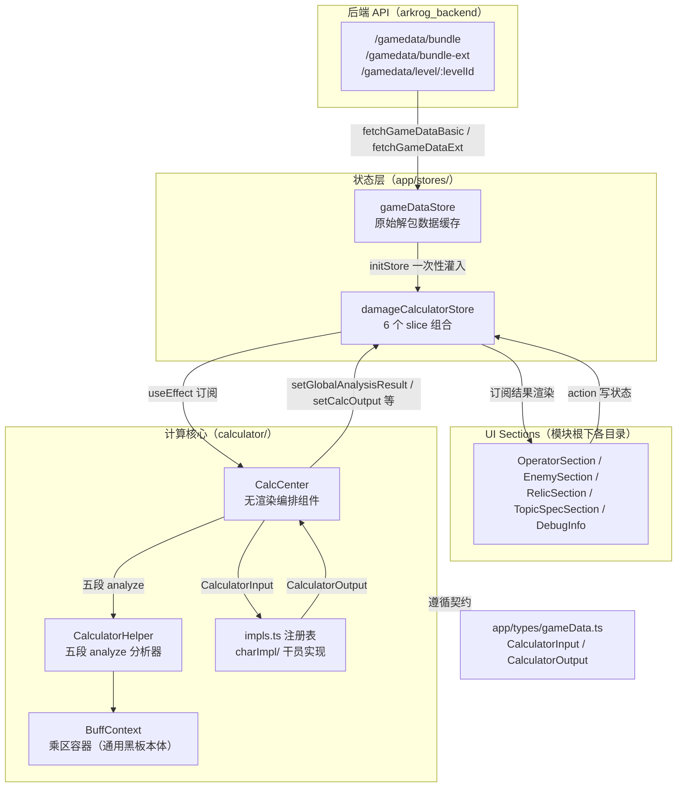
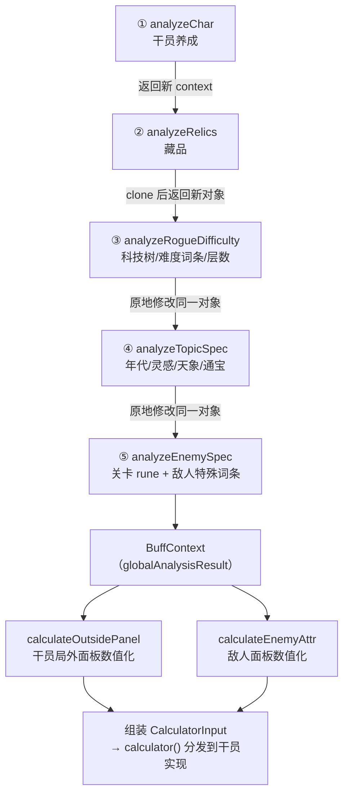
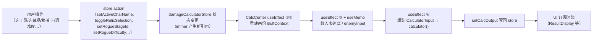

# 01 计算管线架构总览

本文回答一个问题：**一次伤害计算从用户点击到结果上屏，数据经过了哪些环节、每个环节归谁管。**

先说三个事关全局的事实，避免被遗留物误导：

- 计算 **100% 由纯 TypeScript 完成**。`wasm.d.ts`、`app/stores/wasmStore.ts` 是从未接入的残留物，旧文档 `docs/DamageCalculatorDataSchema.md` 描述的 WASM 接口与现行代码完全不符（详见 [08-simulate-and-legacy.md](08-simulate-and-legacy.md)）。
- 计算方式是**期望值公式**而非逐帧模拟。`calculator/simulate-core.ts`、`calculator/simulate/` 目录是废弃的模拟器尝试，不要当现行架构读（取舍背景见 [adr/0002](adr/0002-expectation-formula-vs-frame-simulation.md)）。
- `CalculatorOutput.logs` 恒为空数组（仅在 `calculator/helper.ts` 的 `createCalculatorOutput` 初始化，无任何写入），真正的"运算过程"是 console 调试输出（见 [07-debugging.md](07-debugging.md)）。

> 路径约定：本文中 `calculator/...`、`OperatorSection/...` 等相对路径均相对于模块根 `app/modules/Tool/DamageCalculator/`；`app/...` 开头的路径相对于仓库根。引用代码一律"路径 + 导出符号"。

## 1. 模块边界总图



各边界的职责与不变量：

| 边界 | 位置 | 职责 | 关键约束 |
|---|---|---|---|
| 后端 API | arkrog_backend 仓库 | 提供解包数据 bundle 与按关卡懒加载的 LevelData | 有 HTTP 强缓存陷阱与 ACTIVE_CHARS 白名单，见 [数据管线 Runbook](../../../../../docs/data-pipeline.md) |
| gameDataStore | `app/stores/gameDataStore.ts` | 拉取并缓存原始数据，防重复请求 | 只读缓存，不含交互状态 |
| damageCalculatorStore | `app/stores/damageCalculatorStore.ts` | 计算器全部交互状态与计算结果，zustand + immer + devtools | UI 与计算核心之间的唯一通道；state 被 immer 冻结，slice 内修改需深拷贝 |
| UI Sections | 模块根各目录 | 渲染与采集用户输入 | **只调 store action，从不直接调 `calculator`** |
| calculator/ | `calculator/` | 纯 TS 计算核心 | 除 `CalcCenter.tsx` 外不依赖 React，分析器与干员实现均为可 headless 调用的函数 |
| 类型契约 | `app/types/gameData.ts` 的 `CalculatorInput`/`CalculatorOutput` | 计算入口的输入输出 schema | 权威定义见 [06-data-schema.md](06-data-schema.md) |

store 的 6 个 slice 分工（组合于 `app/stores/damageCalculatorStore.ts` 的 `useDamageCalculatorStore`）：

| slice | 文件（`app/stores/damageCalculator/slices/`） | 职责 |
|---|---|---|
| gameDataSlice | `gameDataSlice.ts` | `rogueInput`（主题/难度/层数/科技树/已选藏品等，按主题分维度）与关卡区域切换；`setRogueKey`/`setRogueZone`/`setRogueStageId` 为 async（需懒加载 LevelData） |
| charSlice | `charSlice.ts` | 干员列表、`charInput`（养成状态）、`charSpecConfigs` 装配；`setActiveCharName` 会从 localStorage 恢复养成 |
| enemySlice | `enemySlice.ts` | `enemyData` → `enemyBase` 解析、敌人特殊词条 `enemySpec` 装配（含年代印痕强制规则） |
| relicSlice | `relicSlice.ts` | 藏品选中/层数；`setRelicLayer` 按 `utils.ts` 的 `*_layer_sync` 数组做系列层数联动 |
| calculatorSlice | `calculatorSlice.ts` | `initStore` 一次性预处理（含藏品 disabled 标记）、两份 BuffContext 与 `calcOutput` 的存取、`resetStore` |
| uiSlice | `uiSlice.ts` | 藏品弹层与主题加成弹层的互斥开关 |

## 2. 五段 analyze 管线

管线编排者是 `calculator/CalcCenter.tsx`（默认导出 `CalcCenter`）——一个返回 `null` 的无渲染组件，挂载于 `app/modules/Tool/index.tsx` 的 `ToolIndex` 顶部。它是**全模块唯一调用 `calculator()` 的地方**。

五段分析器都是 `calculator/helper.ts` 的 `CalculatorHelper` 静态方法，链式调用产出一份 `BuffContext`（`calculator/buff-context.ts`，即通用黑板本体，乘区语义见 [02-buff-context-and-formulas.md](02-buff-context-and-formulas.md)）：



每段职责一览（"写入乘区"列只列典型项，完整语义见各专题文档）：

| 段 | 函数（`calculator/helper.ts`） | 主要输入 | 写入哪些乘区 | context 参数处理 |
|---|---|---|---|---|
| ① | `analyzeChar` | `charInput`、`charData` | 信赖/潜能/模组 `attributeBlackboard` → `relic_rune_add.*`；干员实现的 `applyTalent` → 任意乘区；干员特殊配置 → `in_game_buff_final_mul.atk_scale`（目前仅支持 `atk_scale` 一个 key） | 传入 context 时先 `clone()` 再写；未传则新建。CalcCenter 中作为第一段不传 |
| ② | `analyzeRelics` | `relics`（数据+wrapper）、`charInput.attributeModifier`、`enemyData`、`stageData` | 用户修正属性 → `relic_rune_mul.atk` / `in_game_buff_mul.atk` / `in_game_buff_final_add.atk` / `in_game_buff_add.attack_speed`；每个藏品经 `applyRelic` 三级分发（黑名单拦截 → 独立黑板 → 按 `isBuffForEnemy` 分流到敌人/干员通用黑板，见 [03](03-relic-adaptation-guide.md)）写局外/局内乘区；末尾把 `in_game_buff_final_mul.enemy_damage_scale_phy/mag/pure` 挂入 `global_buff_stack.damage_scale_*` | 同 ①：传入则 `clone()` 返回新对象 |
| ③ | `analyzeRogueDifficulty` | `rogueInput`、`enemyData` | 科技树 → `relic_rune_mul.atk/def/max_hp`；rogue_4/rogue_5 难度词条（全部硬编码在函数体内）→ `in_game_buff_final_mul.enemy_*`、`relic_rune_mul.enemy_*`；rogue_4 思绪混乱 → `relic_rune_mul.atk`、`relic_rune_add.cost`；每层敌人属性指数加成 → `in_game_buff_final_mul.enemy_atk/enemy_max_hp` | **原地修改并返回同一对象**，context 必传 |
| ④ | `analyzeTopicSpec` | `topicSpecItems`（年代/灵感/天象/通宝，由 CalcCenter 按主题组装） | 每项被当作伪藏品复用 `applyRelic` 三级分发，写入乘区由各项黑板决定（数据来源与档位映射见 [05](05-topic-spec-and-enemy-spec.md)） | 原地修改 |
| ⑤ | `analyzeEnemySpec` | `enemySpec`、`enemyData`、`stageData`、`levelData` | 关卡 rune 按难度筛选后包装成名为「关卡加成」的伪藏品走 `applyRelic`；`enemySpec` 伪黑板按 `bbKey` 直写槽位：`enemy_damage_resistance` / `in_game_buff_final_add.enemy_def` / `in_game_buff_final_mul.enemy_atk` / `in_game_buff_final_mul.enemy_max_hp`（见 [05](05-topic-spec-and-enemy-spec.md)） | 原地修改 |

> ⚠️ **副作用差异是这条管线最大的隐蔽约定**：①② 对传入 context 做 `clone()` 后写入（无副作用，返回新对象），③④⑤ 直接修改传入对象。链式一遍调用是安全的，但若把同一份 context 重复喂给 ③④⑤（例如在测试里复用 fixture context），加成会**重复叠加**。新增分析步骤时请显式选择并文档化自己的副作用模式。

管线产物 `BuffContext` 仍是表达式树，最终由两个函数数值化：

- `calculator/helper.ts` 的 `calculateOutsidePanel`：从 `charInput.phase` 的属性关键帧出发，应用局外加算/乘算（乘算处 `Math.round` 取整）得到局外面板；攻回类技能（`spType === "INCREASE_WHEN_ATTACK"`）强制 `spRecoveryPerSec = 0`。结果作为 `CalculatorInput.charInput.attribute`。
- `calculator/helper.ts` 的 `calculateEnemyAttr`：合成敌人 atk/def/maxHp 与减伤。敌人减伤为 `1 - (1 - 局内 union) * (1 - 局外 max)` 双乘区合成（公式细节与 `stage_rune_mul` 幽灵乘区的说明见 [02](02-buff-context-and-formulas.md)）。

## 3. 双 BuffContext：globalAnalysisResult 与 relicAnalysisResult

CalcCenter 用两个独立的 useEffect 维护**两份**几乎相同的 BuffContext：

| | globalAnalysisResult | relicAnalysisResult |
|---|---|---|
| 包含 ①analyzeChar（养成） | 是 | **否** |
| ⑤analyzeEnemySpec 的入参 | `enemySpec` + `enemyData` + `stageData` + `levelData`（**含关卡 rune**） | 仅 `enemySpec`（**不含关卡 rune**） |
| 写回 store 的 action | `setGlobalAnalysisResult`（calculatorSlice） | `setRelicAnalysisResult`（calculatorSlice） |
| 消费方 | 真正的计算（`CalculatorInput.buffContext`）、敌人表达式与面板、`OperatorSection/OperatorAttributes.tsx` 的属性表达式展示 | `RelicSection/BuffPanel.tsx` 与 `RelicSection/RelicSelector.tsx` 的"Buff 一览"，经 `CalculatorHelper.outputAdditionEntry` 转为字符串列表 |

存在原因：Buff 一览面板回答的是"**我选的藏品/主题环境给了多少加成**"，干员的信赖、潜能、模组属于养成而非环境加成，混进去会让面板数字与藏品描述对不上；而实际计算必须含养成。两份 context 因此刻意分叉。

> ⚠️ **新增分析步骤必须两处同步。** 两条链各自手写在 CalcCenter 的两个 useEffect 里，没有共享的"步骤注册表"。只改其一的症状是：只改 global → "算了但 Buff 一览不显示"；只改 panel → "面板显示了但伤害没变"。另外注意 `app/stores/damageCalculator/slices/calculatorSlice.ts` 还有一个 `updateGlobalAnalysisResult` action，内含第三份只有 ①②③ 三段的组装逻辑——当前全仓库**无调用方**，属于待清理的漂移源（已登记 [known-issues.md](known-issues.md)），不要参照它新增步骤。

## 4. 重算触发链路

数据流严格单向，UI 从不直接计算：



CalcCenter 内部的全部反应单元（按源码顺序）：

| 单元 | 触发依赖（节选） | 产出 |
|---|---|---|
| useMemo `selectedRelics` | `rogueInput[topic].relics`、`relicWrapperMap`、`relicDataMap` | 选中且 `userActive` 的藏品（数据+wrapper 合并） |
| useMemo `topicSpecItems` | `rogueInput`、四组 `rogue4_*/rogue5_*_spec_items` | 当前主题生效的年代/灵感/天象/通宝列表 |
| useEffect ① | charInput / charData / enemyData / enemySpec / levelData / rogueInput / selectedRelics / stageData / topicSpecItems | `setGlobalAnalysisResult` |
| useEffect ② | 同上但不含 levelData | `setRelicAnalysisResult` |
| useEffect ③ | enemyBase、globalAnalysisResult | `setEnemyExpression`（敌人属性表达式树，供面板悬浮公式） |
| useMemo `enemyInput` | enemyBase、globalAnalysisResult | 敌人最终面板数值，**不写入 store**，仅在组件内传给计算 |
| useEffect ④ | charInput、enemyInput、globalAnalysisResult、selectedRelics、rogueInput 等 | `calculator(input)` → `setCalcOutput`；同时 `CalculatorHelper.print` 打印标准日志 |
| useEffect ⑤ | charInput、enemyBase、rogueInput、stageId、selectedIds | 持久化到 `calculatorStorage`（`app/stores/damageCalculator/localStorage.ts`） |
| useEffect ⑥ | `[]`（仅首载） | 从 localStorage 恢复主题与干员（受 `localStateInited` 守卫，见第 6 节） |

计算入口 `calculator/calculator.ts` 的 `calculator` 只做一件事：按 `input.charData.name` 从注册表取干员实现并调用。结果消费方：

- `OperatorSection/ResultDisplay.tsx` ← `calcOutput`（普攻/技能/周期 × 物理/法术/真实/元素），其中 `logs` 字段被显式过滤不渲染；
- `EnemySection/EnemyDisplay.tsx`、`EnemySection/EnemyMiniPreview.tsx` ← `enemyExpression`（表达式树逐级展开，tooltip 溯源加成来源）;
- `RelicSection/BuffPanel.tsx`、`RelicSection/RelicSelector.tsx` ← `relicAnalysisResult`。

判断"改了 X 为什么没重算"时，按此链路检查：X 是否进了 store → 是否出现在 CalcCenter 对应 useEffect 的依赖数组 → 对应 analyze 段是否消费了它。三处缺一即静默不重算。

## 5. 干员实现自动注册机制

干员的最终 DPS 由每干员一份的手写脚本计算（写法规范见 [04-char-impl-cookbook.md](04-char-impl-cookbook.md)）。注册机制在 `calculator/index.ts`：

```
const modules = import.meta.glob("./charImpl/*/**.ts", { eager: true });
// 注册键 = 文件名去掉 .ts —— 即必须严格等于 charData.name 的中文名
```

机制要点：

| 约定 | 内容 |
|---|---|
| 注册键 | 文件名（不含 `.ts`），查找键是 `charData.name`（`calculator/calculator.ts` 的 `calculator`）。**文件名必须等于干员中文名**，如 `charImpl/近卫/赫德雷.ts` |
| 模块导出 | `export const calculator`（或 `export default`）为计算函数；`applyTalent`、`applySkill`、`charSpecConfigs` 可选，缺省以 `console.warn` 空实现兜底（`calculator/index.ts` 的 `voidApplyTalent`/`voidApplySkill`） |
| 注册表 | `calculator/impls.ts` 的 `implMap`，写入用 `registerCalculatorImpl`，读取用 `getCalculatorImpl`/`getCharImpl` |
| 未注册兜底 | `getCalculatorImpl` 对查不到的名字返回"打 warn + 全 0 输出"的空实现（`CalculatorHelper.createCalculatorOutput`），**UI 不报错** |
| applyTalent vs applySkill | `applyTalent` 在 ①analyzeChar 中被调用、**参与 DPS 计算**；`applySkill` 不在计算链路内，仅 `OperatorSection/OperatorAttributes.tsx` 的技能面板模式用它展示属性 |

> ⚠️ glob 模式 `./charImpl/*/**.ts` 中的 `*/` 要求文件必须位于 `charImpl/` 的**子目录**内：直接放在 `charImpl/` 根目录的文件不会被扫描。现存反例 `charImpl/Hoederer_beta.ts` 位于根目录，从未被任何模块导入，其文件内手写的 `registerCalculatorImpl("Hoederer_beta", ...)` 实际**从不执行**（详见 [08](08-simulate-and-legacy.md)）。

> ⚠️ 注册键 = 文件名意味着**改文件名即静默失效**：干员仍可选中，但计算结果变为全 0，唯一线索是控制台的"计算器实现为空" warn。新增干员后务必在页面上确认结果非 0。

与之平行的另一张注册表是 `calculator/impls.ts` 的 `relicBlackboardMap`（藏品独立黑板，`registerRelicBlackboard` 注册、注册调用集中在 `calculator/blackboard.ts`），它服务于 ②④ 段的 `applyRelic` 分发，机制与坑见 [03-relic-adaptation-guide.md](03-relic-adaptation-guide.md)。

## 6. 特殊分支与已知现状

### 木桩跳过表达式与加成

敌人名为 `木桩` 时走完全不同的分支：CalcCenter 的 useEffect ③ 直接 `setEnemyExpression({})`（不构建任何表达式）；`calculateEnemyAttr` 开头直接返回 `enemyBase` 原值，不应用任何乘区。木桩属性由用户在 `EnemySection/EnemyDisplay.tsx` 中手动编辑，作为"自定义靶子"使用。验证藏品对敌人侧的效果时不要选木桩——所有敌人侧乘区都不会生效。

### 带船关/异格关自动注入藏品

`app/stores/damageCalculator/calcUtils/gameDataUtils.ts` 的 `handleUpdateStageId` 在切换关卡时按 stageId 硬编码名单自动追加藏品：

| 名单 | 自动注入 | 含义 |
|---|---|---|
| `stageWithBoatIds`（紧急授课/思维矫正/朝谒/魂灵朝谒/授法 等 rogue_4 关卡） | `rogue_4_relic_final_6`（阿纳萨） | 带船关默认携带结局藏品 |
| `stageWithRollingAncestorIds`（思维矫正/魂灵朝谒 的异格变体） | `rogue_4_relic_explore_7`（滚动先祖） | 异格关默认携带 |

> ⚠️ 这些藏品**不是用户选的**，但会进入 `selectedRelics` 参与计算。做"选中藏品 → buff 量"对账或录制 fixture 时，必须把自动注入项计入预期，否则会出现"凭空多出来的加成"。关卡 ID 名单为版本敏感硬编码，登记于 [version-sensitive-hardcode.md](version-sensitive-hardcode.md)。

### 模块级 localStateInited 与 resetStore 空操作

两个相互纠缠的现状，共同决定了"离开再回到 /tool 页"的行为：

- `calculator/CalcCenter.tsx` 顶部的 `localStateInited` 是**模块级变量**（不是 state/ref）：首个 CalcCenter 实例完成 localStorage 恢复后置 true，此后组件即使卸载重挂（路由往返、HMR）也**不再恢复**本地状态；保存 effect 则以它为闸门，置 true 前不写 localStorage。
- `app/stores/damageCalculator/slices/calculatorSlice.ts` 的 `resetStore` 是**空操作**——重置逻辑被注释掉了，只剩 console.log。`app/modules/Tool/index.tsx` 的 `ToolIndexWrapper` 在卸载时仍会调用它，但 store 实际不重置。

两者叠加的净效果：同一页面会话内，离开 /tool 再回来，zustand store 里的干员/藏品/主题选择全部原样保留（靠"没重置"而非"恢复"实现）；重新进入时 `initStore` 会重新灌入解包数据并重置关卡/敌人/藏品映射，但不会动 `charInput`、`rogueInput.topic` 等交互状态。

> ⚠️ 这是"现状"而非"设计"：若未来有人恢复 `resetStore` 的实现，而 `localStateInited` 仍为 true 跳过恢复，二次进入会得到一个既没重置干净又没恢复的混合状态。改动任一处前先读 [known-issues.md](known-issues.md) 中的登记项。

## 7. 模块目录地图

模块根 `app/modules/Tool/DamageCalculator/`：

| 路径 | 一句话职责 |
|---|---|
| `calculator/CalcCenter.tsx` | 无渲染计算中枢：五段 analyze 编排、重算触发、localStorage 持久化 |
| `calculator/calculator.ts` | 计算总入口 `calculator`（按干员名分发）；`calculator_beta` 无调用点（遗留） |
| `calculator/index.ts` | barrel 导出 + `import.meta.glob` 干员实现自动注册 |
| `calculator/impls.ts` | 两张注册表：`implMap`（干员实现）与 `relicBlackboardMap`（独立黑板），及黑板取值工具 `getByKey` 系列 |
| `calculator/helper.ts` | `CalculatorHelper`：五段分析器、面板数值化、`print`/`printAdditionContext` 调试输出 |
| `calculator/buff-context.ts` | `BuffContext`：乘区分桶容器与手写 `clone()`（[02](02-buff-context-and-formulas.md)） |
| `calculator/expression-util.ts` | `ExpressionUtil`：干员/敌人属性合成公式（[02](02-buff-context-and-formulas.md)） |
| `calculator/blackboard.ts` | 全部 `registerRelicBlackboard` 独立黑板注册（数十处）+ 干员/敌人两个通用黑板（[03](03-relic-adaptation-guide.md)） |
| `calculator/ast/` | 表达式树节点（`NumericLiteralNode`/`ExpressionGroupNode`）：求值、UI 公式渲染、tooltip 溯源三职合一 |
| `calculator/charImpl/` | 干员实现脚本，按职业分子目录，文件名=干员中文名（[04](04-char-impl-cookbook.md)） |
| `calculator/debug/` | `applyAnyRelics`/`printRelicsInfo`——名义调试代码，实际 `applyAnyRelics` 是 `initStore` 藏品置灰与通宝有效性判定的生产关键路径 |
| `calculator/simulate-core.ts`、`calculator/simulate/` | 废弃的逐帧模拟残骸，勿在其上开发（[08](08-simulate-and-legacy.md)） |
| `wasm.d.ts` | 从未接入的 WASM 类型残留（[08](08-simulate-and-legacy.md)） |
| `OperatorSection/` | 干员区 UI：选择器、养成面板、属性表达式展示、`ResultDisplay` 结果表 |
| `EnemySection/` | 敌人区 UI：主题/关卡/敌人选择、敌人面板、`EnemySpecSelector` 特殊词条配置表（[05](05-topic-spec-and-enemy-spec.md)） |
| `RelicSection/` | 藏品弹层、层数输入、底栏 `FooterPanel` 与 Buff 一览 `BuffPanel` |
| `TopicSpecSection/` | 主题加成弹层：rogue_4 年代/灵感、rogue_5 天象/通宝（[05](05-topic-spec-and-enemy-spec.md)） |
| `DebugInfo/` | 仅 DEV 挂载的调试面板（[07](07-debugging.md)） |
| `utils.ts` | 通用黑板的全部名单与选择器：key 白名单、黑名单、局内名单、层数同步组等（[03](03-relic-adaptation-guide.md)） |
| `black-list.ts` | `DamageCalculatorSettings`：按干员禁用尚未适配的技能 |
| `docs/` | 本文档目录（[阅读顺序](README.md)） |

模块外的紧密协作方：

| 路径 | 职责 |
|---|---|
| `app/stores/damageCalculatorStore.ts` + `app/stores/damageCalculator/` | 状态层：slices、`calcTypes.ts`（类型契约）、`calcConstants.ts`（初始值）、`calcUtils/`（关卡/藏品/干员预处理）、`localStorage.ts`（版本化持久化） |
| `app/stores/gameDataStore.ts` | 解包数据拉取与缓存（上游链路见 [数据管线 Runbook](../../../../../docs/data-pipeline.md)） |
| `app/types/gameData.ts` | `CalculatorInput`/`CalculatorOutput` 等契约（[06](06-data-schema.md)） |
| `test/DamageCalculator/` | 金值测试（现状全红，见 [09-fixtures-and-baselines.md](09-fixtures-and-baselines.md)） |

## 深入阅读

- 乘区定义、属性合成公式、新增乘区的三处同步：[02-buff-context-and-formulas.md](02-buff-context-and-formulas.md)
- 藏品/通宝接入与三级分发判定：[03-relic-adaptation-guide.md](03-relic-adaptation-guide.md)
- 干员实现写法与命名铁律：[04-char-impl-cookbook.md](04-char-impl-cookbook.md)
- 主题/敌人伪黑板语义：[05-topic-spec-and-enemy-spec.md](05-topic-spec-and-enemy-spec.md)
- 输入输出契约：[06-data-schema.md](06-data-schema.md)；术语对照：[术语表](../../../../../docs/glossary.md)
