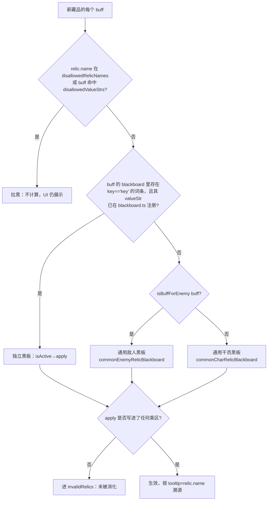

# 藏品 / 通宝增益接入手册

> 本文是「上游更新后，让一个新藏品或通宝在计算器里产生正确增益」的操作主路径，也是中期自动化目标（数据更新→验证→输出新增藏品 buff 量）的前置知识。读完应当能在**不通读源码**的前提下独立完成一次接入。
>
> 术语（藏品 / 通宝 / 乘区 / 通用黑板 / 独立黑板 / 伪黑板）见 [术语表](../../../../../docs/glossary.md)。乘区的精确语义与合成公式见 [02-buff-context-and-formulas.md](02-buff-context-and-formulas.md)。本文出现的所有源码路径相对于模块根 `app/modules/Tool/DamageCalculator/`。

## 0. 一句话心智模型

每个藏品（`RelicDataExt`）携带若干 **buff**（`RelicBuff`），每个 buff 携带一个 **blackboard 词条数组**（`{key, value, valueStr}[]`，这是上游解包数据）。计算时 `CalculatorHelper.applyRelic`（`calculator/helper.ts`）**逐 buff** 决定把它交给谁处理，处理者把数值写进 `BuffContext` 的某个**乘区**。你的接入工作，本质就是：**让某个 buff 的数值，写进正确的乘区**。

## 1. 新藏品如何到达前端（无需前端改动）

上游 `ArknightsGameData` 更新 → 后端 `update-data` 重建 → `/gamedata/bundle-ext` → 前端 `gameDataStore` 的 `relics` / `items`。前端 `getRelicsData`（`app/stores/damageCalculator/calcUtils/relicUtils.ts`）把 `ItemData` 与 `RelicData` 合并成 `RelicDataExt`，藏品即出现在选择器里——**数据层不需要改任何前端代码**。完整链路与缓存陷阱见 [data-pipeline.md](../../../../../docs/data-pipeline.md)。

需要前端改动的只有一件事：**这个藏品的 buff 效果能不能被算对**。下面是判定与接入。

## 2. 判定决策树：走通用黑板，还是注册独立黑板？



**接入决策的实操顺序：**

1. **先假设走通用黑板**。打开浏览器、开启 `debugRelic` 日志（见 [07-debugging.md](07-debugging.md)），选上这个藏品，看 console 里它走了哪条分支、有没有进 `invalidRelics`。
2. 如果 buff 的所有数值 key 都在 `allowedBlackboardKeyMap`（`utils.ts`）里、且选择器（职业/子职业/部署位/敌人/标签/关卡类型）能被通用黑板的 `isActive` 覆盖 → **通用黑板已经算对了，无需写代码**，至多补几个名单（见第 5 节）。
3. 如果效果有特殊条件或特殊数值语义（例如"编队中每有一名伺烛客则…"、"存在某藏品时才生效"、"按层数指数叠加"）通用黑板表达不了 → **注册独立黑板**（第 4 节）。
4. 如果效果当前无法计算或价值过低 → **拉黑**（`disallowedRelicNames`）。

> **建模口径与暂缓范围（[ADR-0007](adr/0007-relic-adaptation-scope-and-best-case.md)）**：
> - **条件型增伤/易伤**（闪避后、敌人浮空时、对被阻挡目标等）按"**最佳情况恒生效**"建模——把 `damage_scale` 倍率原样写入 `global_buff_stack.damage_scale_phy/mag`（与文学/见厉同口径）。计算器是"理论上限"语义。
> - **限制触发次数 / 极短时间窗口型**（技能后 1 秒内 +X% 等）：**暂缓**（最佳情况会高估稳态、缺触发频率模型）。
> - **额外伤害类**（藏品自身造成的独立伤害，`atk_scale`/`extra_aoe_damage` 等）：**暂缓**至计算器演进为模拟引擎驱动版本。
> - 多 buff 藏品只接其中可建模的 buff（按 key 分别注册），其余 buff 自然落入 `invalidRelics`。

## 3. 通用黑板机制详解

`applyRelic` 对每个 buff 的三级分发（顺序固定，`calculator/helper.ts`）：

| 级 | 条件 | 处理者 | 不生效时 |
|---|---|---|---|
| 0 | `isRelicInBlacklist(relic.name)` | —（整个藏品作废） | 进 `invalidRelics` |
| 1 | `isRelicBlackboard(buff)`（key 已注册，见第 4 节） | 该 key 的独立黑板 | `isActive` 为假 → `invalidRelics` |
| 2 | `isBuffForEnemy(buff)` | `commonEnemyRelicBlackboard` | 无 `enemyData` 或 `isActive` 假 → `invalidRelics` |
| 3 | 其余 | `commonCharRelicBlackboard` | `isActive` 假 → `invalidRelics` |

### 3.1 敌我分流：`isBuffForEnemy`（`utils.ts`）

buff 作用于敌人，当且仅当：`buff.key` 以 `enemy` 开头，**或** 某 blackboard 词条 `valueStr` 以 `enemy_` 开头，**或** 以 `trap_` 开头（且不在 `allyTraps`）。否则走干员黑板。

### 3.2 key 白名单与选择器

- **数值 key 白名单**：`allowedBlackboardKeyMap`（`utils.ts`）既是 key→中文翻译表，又是白名单。`isBlackboardActiveForChar` 的最后一关要求 buff **至少有一个 key 在表内**，否则判不生效。**新藏品"没效果"，最常见原因就是它带了一个没登记的 key。**
- **干员选择器**（`isBlackboardActiveForChar`）支持：`selector.profession`（职业）、`selector.sub_profession`（子职业）、`selector.buildable`（近战/远程部署位）。
- **敌人选择器**（`commonEnemyRelicBlackboard.isActive`）支持：`selector.enemy`、`selector.char`（trap 类 ID）、`selector.enemy_level_type`、`tag`、`validator.roguelike_event_type`（`BATTLE_BOSS`/`DUEL`）、`validator.roguelike_sky_zone_event_type`（界园岁兽残识）。

### 3.3 局内 / 局外判定（干员黑板）

`commonCharRelicBlackboard.apply` 里：

```
inGame = inGameRelicNames.includes(relic.name)
         || ["buff","ability"].some(kw => buff.key.includes(kw))
```

- **局外**（`relic_rune_*`）：常态。属性百分比写进 `relic_rune_mul`，攻速一律写进 `relic_rune_add`。
- **局内**（`in_game_buff_*`）：满足上式才算。攻击/防御/生命百分比走 `in_game_buff_mul`。

> ⚠️ 局内/局外只差一层"先加后乘"，但数值会偏。**新藏品若是局内生效但名字没进 `inGameRelicNames`、key 也不含 `buff`/`ability`，会被错算进局外乘区。** 见 [02](02-buff-context-and-formulas.md) 的合成顺序。

### 3.4 层数双轨（容易错）

通用干员黑板里层数取法**不统一**：

| 写入 | 层数因子 | 受 `layer_` 前缀控制? |
|---|---|---|
| 局外 `atk`/`max_hp`/`def`（裸 key） | `layer` | 是（`buff.key.startsWith("layer_") ? relic.layer : 1`） |
| 局内分支全部 | `relic.layer` | 否，无条件乘 |
| `multiplier@atk` | `layer` | 是 |
| `multiplier@max_hp` / `multiplier@def` | `relic.layer` | 否，无条件乘 |

UI 是否显示层数输入由 `relicHasLayer`（`relicUtils.ts`：`buff.key` 以 `layer_char`/`char_squad` 开头，或 valueStr 在 `layerValueStrs`，或 key 含 `stack`）独立判定，**可能与计算层逻辑脱节**。给一个本不该叠层的藏品填了层数，会得到错误结果。

### 3.5 数值正负双语义（敌人乘区）

`commonEnemyRelicBlackboard.apply` 与独立黑板 `defdown[support]` 对 `atk`/`max_hp`/`def` 用：

```
value = Math.sign(v) === 1 ? v : 1 + v
```

即**正数当倍率**（`1.3` = +30%），**负数当增量**（`-0.3` → `1 + (-0.3) = 0.7` = ×0.7），写进 `in_game_buff_final_mul.enemy_*`（真乘区）。上游两种写法都存在，照抄别的 case 前先确认数据是哪种符号，否则翻倍或减半。

## 4. 注册独立黑板（核心）

### 4.1 注册键的准确来源

独立黑板按 key 注册到 `relicBlackboardMap`（`calculator/impls.ts`）。查找时（`getRelicBlackboard` / `isRelicBlackboard`）：

```
key = buff.blackboard.find(b => b.key === "key")?.valueStr ?? "char"
```

> ⚠️ **注册键 = buff 的 blackboard 里那个 `key === "key"` 的词条的 `valueStr`**——不是 `buff.key`，也不是藏品 id。先用 `debugRelic` 日志或断点把这个 valueStr 抄准，再去注册。

### 4.2 注册方式（靠模块副作用）

在 `calculator/blackboard.ts` 顶层直接调用 `registerRelicBlackboard(key, { isActive, apply })` 即可——**不需要在别处导入**，`calculator/index.ts` 的 `export *` 会触发本文件的注册副作用。

```ts
registerRelicBlackboard("<上面抄准的 valueStr>", {
  isActive(input): boolean {
    // input: { buff, relic, charData?, charInput?, enemyData?, relics }
    // 返回这个 buff 此刻是否生效（职业/敌人/前置藏品等条件）
    return true;
  },
  apply(input): void {
    // input: { buff, relic, context, relics }
    const { context, buff, relic } = input;
    const v = getByKeySafe(buff.blackboard, "atk"); // 取词条
    context.in_game_buff_mul.atk.addChild(
      new NumericLiteralNode(v.value * relic.layer, relic.name), // tooltip 必须 = relic.name
    );
  },
});
```

**两条铁律：**

1. **`apply` 选哪个乘区，决定数值对不对。** 乘区对照见下表，精确语义见 [02](02-buff-context-and-formulas.md)。
2. **`NumericLiteralNode` 的第二个参数（tooltip）必须填 `relic.name`。** 加成溯源（`CalculatorHelper.printRelic`）和通宝有效性判定（`getRogue5Coppers`）都靠 `child.tooltip === relic.name` 字符串匹配。写错字（例如把硬编码字符串拼错）会丢失溯源与有效性判定。

### 4.3 乘区选择对照表（apply 写哪里）

| 想要的效果 | 写入乘区 | 现成案例（blackboard.ts） |
|---|---|---|
| 干员攻击力 ×% | `in_game_buff_mul.atk` | `rogue_2_atk_up_in_range`（支柱-援护） |
| 干员攻速 +N | `in_game_buff_add.attack_speed` | `rogue_4_caster_hand[pair]`（波纹之手） |
| 干员攻速 +N（局外/化境） | `relic_rune_add.attack_speed` | `rogue_5_character_sp_zone_attri_up`（画人间） |
| 技力回复 +N/s | `in_game_buff_add.sp_recovery_per_sec` | `modify_sp[attack_or_damage]` |
| 法术/物理增伤（堆叠区） | `global_buff_stack.damage_scale_mag` / `_phy` | `damage_scale[caster]`（苦难巫咒） |
| 敌人易伤 ×% | `in_game_buff_final_mul.enemy_damage_scale_phy` 等 | `enemy_damage_scale[phy]` |
| 敌人防御/法抗降低 | `in_game_buff_final_mul.enemy_def` / `enemy_magic_resistance` | `defdown[support]`（枯法） |
| 敌人减伤（局外取 max） | `relic_rune_mul.enemy_damage_resistance` | `enemy_damage_resistance[inf]` |
| 敌人生命上限 ×（局外） | `relic_rune_mul.enemy_max_hp` | `rune_mul_enemy_max_hp` |
| 最终乘区攻击（如沙暴减攻） | `in_game_buff_final_mul.atk` | `env_001_storm`（厉-无皎之昧） |

### 4.4 五个梯度案例（照着改）

- **最简（无条件、定值）**——`rogue_2_attack_speed_up[life_point]`（国王的新枪）：`isActive: () => true`，`apply` 直接 `in_game_buff_add.attack_speed.addChild(new NumericLiteralNode(50, relic.name))`。
- **带职业选择器**——`rogue_3_rangedATKUp`（岩角号）：`isActive` 读 `selector.profession`，命中 `charData.profession` 才生效；`apply` 写 `in_game_buff_mul.atk`，数值 `atk.value * relic.layer`。
- **带层数 / 指数**——`rogue_3_relic_book_7`（断杖-波纹）：`apply` 写 `global_buff_stack.damage_scale_mag`，数值 `1 + damage_scale_factor.value * relic.layer`（注意此处 tooltip 硬编码为 `"断杖-波纹"`——这正是 4.2 铁律 2 警示的写法，能用但脆，新写一律用 `relic.name`）。
- **依赖其他藏品 / 编队**——`rogue_4_caster_hand[pair]`（波纹之手）：`isActive` 用 `input.relics.some(r => r.id === reliance_relics.valueStr)` 判断前置藏品存在、且子职业匹配；伺烛客类 `rogue_5_character_in_candle_holder_common_buff[stack]` 用 `input.charInput?.candleHolder === true` 判断。
- **写敌人乘区**——`rune_mul_enemy_max_hp`：`isActive` 读 `selector.enemy` 对比 `enemyData.id`，`apply` 写 `relic_rune_mul.enemy_max_hp`。

## 5. 名单同步清单（改完独立黑板别忘了这些）

全部在 `utils.ts`（层数初值在 `relicUtils.ts`）。漏改都是**静默**的——不报错，只是数值不对或选项不显示。

| 场景 | 要改的数组 | 漏改症状 |
|---|---|---|
| buff 带了通用黑板不认识的数值 key | `allowedBlackboardKeyMap` | 整个 buff 被判不生效，藏品"没效果" |
| `buff.key` 以 `global` 开头、效果作用于干员 | `allowedBlackboardValueStrs` | 全局类 buff 不被纳入 |
| 效果实际施加于敌人（但 key 不以 enemy 开头） | `blackboardValueStrsForEnemy` | 被当成干员增益处理 |
| 效果带层数（且 key 不以 `layer_` 开头） | `layerValueStrs` | 层数不生效或叠层判定错 |
| 局内生效的藏品 | `inGameRelicNames` | 被错算进局外乘区，数值偏 |
| 同系列藏品层数应联动 | 对应的 `*_layer_sync`（如 `assertions_layer_sync`、`sizhuke_layer_sync`） | 改一件层数其余不跟随 |
| 决定不实现 / 无法实现 | `disallowedRelicNames`（按中文名）或 `disallowedValueStrs`（按 valueStr） | 一直进 `invalidRelics` 或算出错值 |
| 初始层数应为 0 | `relicUtils.ts` 的 `zeroInitLayerRelicNames` | 默认从 1 层起算 |

> 这些名单是"必随版本漂移"的内容，已由 `yarn docs:gen` 导出到 [generated/allowed-keys.md](generated/allowed-keys.md)。改名单后请重跑生成脚本。

## 6. 通宝（copper）

通宝是 rogue_5（界园）特有项，但在代码里**没有独立类型**，与藏品同表同构：

- **识别**：`Rogue5Selector.tsx` 用 `id.includes("copper")` 从 relics 表里捞出通宝。
- **生效路径**：通宝不进 `CalculatorInput.relics`，而是经主题特殊项（topicSpec）强转成 `RelicDataExt & RelicWrapper` 走 `analyzeTopicSpec` → 同一套 `applyRelic` 管道（详见 [05-topic-spec-and-enemy-spec.md](05-topic-spec-and-enemy-spec.md)）。
- **置灰判定**：`getRogue5Coppers`（`use-rogue5-topic-spec-items.ts`）对每个通宝跑 `applyAnyRelics`，收集产生了数值的 tooltip（按 `relic.name`）；名字没出现在结果里的通宝 `disabled = true`（UI 置灰，表示"计算器还没适配"）。
- **适配方式**：与藏品完全一致——能走通用黑板就走，不能就在 `blackboard.ts` 注册独立黑板。现有通宝独立黑板案例：`rogue_5_character_sp_zone_attri_up`（画人间）、`env_001_storm`（厉-无皎之昧）、`attri_up_filter_level_cost`（奔兽战车）。

> ⚠️ `applyAnyRelics`（`calculator/debug/print-relics-info.ts`，标了 `@deprecated`）**跳过 `isActive`**、无条件 apply 所有 buff，因此互斥 buff 会同时生效。它**只能用于"是否已实现黑板"的判定**（通宝置灰正是这个用途），**不能用于数值验证**。数值验证必须走 `analyzeRelics` 真实路径。
>
> ⚠️ 独立黑板里读 `input.relics` 时注意：**通宝路径下 `relics` 只包含已激活的主题特殊项，而非全部藏品。** 依赖 `relics` 扫描的逻辑（如波纹之手的前置藏品检测、奔兽战车的费用累加）在"藏品路径"和"通宝路径"下语义不同。

## 7. 失败模式排查表

| 症状 | 根因 | 排查入口 |
|---|---|---|
| 新藏品完全没效果 | buff 的数值 key 不在 `allowedBlackboardKeyMap`；或独立黑板注册键（`key=='key'` 词条的 valueStr）拼错，`isRelicBlackboard` 判否后落回通用黑板而通用黑板消化不了 | `debugRelic` 看分支与 `invalidRelics`；核对注册 valueStr |
| 效果只生效一部分 | 通用黑板"部分消化"：只吃到 `atk` 等已知 key，丢掉特殊条件词条，且不报错 | 看 `invalidRelics` 是否**没有**它（说明被部分消化） |
| 数值翻倍 / 减半 | 正负双语义（3.5）抄错符号；或层数双轨（3.4）多乘/漏乘 `relic.layer` | 对照 4.3 与 3.4 |
| 局内藏品数值偏 | 名字没进 `inGameRelicNames`、key 不含 `buff`/`ability`，被算进局外乘区 | 3.3 |
| 加成溯源 / 面板里看不到该藏品 | `apply` 的 `NumericLiteralNode` tooltip 没填 `relic.name`（拼错或硬编码错字） | 4.2 铁律 2 |
| 通宝一直置灰 | `applyAnyRelics` 跑下来没产生数值 = 没适配；或 tooltip 不等于 `relic.name` 导致有效性判定丢失 | 第 6 节 |

排查方法的完整版（`debugRelic` 日志怎么读、断点怎么打）见 [07-debugging.md](07-debugging.md)。把"新藏品 buff 量"做成自动报告的方案见 [10-relic-buff-verification.md](10-relic-buff-verification.md)。已确认的存量数据笔误见 [known-issues.md](known-issues.md)（自动验证对账前必读）。
