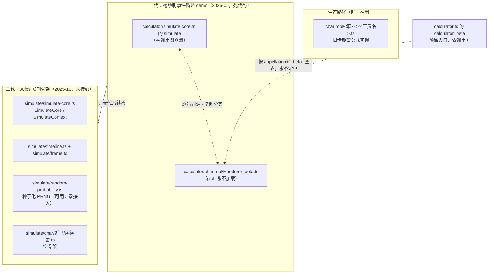

# 模拟器现状盘点与遗留代码清单

本文回答三个问题：**哪些代码在用、哪些是残骸、残骸里有什么还值得留**。模块内与"模拟"沾边的文件全部不在生产路径上，但其中混着崩溃陷阱、可复用的事件逻辑和一份必须冻结的 PRNG 契约——分别需要不同的处置方式。

阅读前提：了解生产计算管线（见 [01-architecture.md](01-architecture.md)）与干员期望公式写法（见 [04-char-impl-cookbook.md](04-char-impl-cookbook.md)）。

## 1. 生产路径声明：模拟引擎零参与

**当前所有 DPS 输出 100% 由 charImpl 期望公式产出，帧模拟引擎对生产结果的贡献为零。**

调用链：`calculator/CalcCenter.tsx` 的 `CalcCenter` 组件在重算 effect 中调用 `calculator/calculator.ts` 的 `calculator`，后者按 `input.charData.name` 经 `calculator/impls.ts` 的 `getCalculatorImpl` 查注册表，分发到 `calculator/charImpl/<职业>/<干员名>.ts` 的同步期望公式实现，结果经 `setCalcOutput` 进入 store。这条链上没有任何模拟代码。

判据（均可 grep 复核）：

- `calculator/simulate/` 目录下四个文件没有任何外部 import；
- `calculator/calculator.ts` 的 `calculator_beta`（模拟路径预留入口）全仓库零调用方；
- `calculator/charImpl/Hoederer_beta.ts` 从未被模块加载（原因见下表）。

"为什么选期望公式而非帧模拟"的决策背景与推翻条件见 [adr/0002-expectation-formula-vs-frame-simulation.md](adr/0002-expectation-formula-vs-frame-simulation.md)。

> ⚠️ **不要在残骸上继续开发。** 新人最常见的误判是认为某份 simulate 代码在生产中起作用，进而去"维护"它，或在一代 demo（被调用即抛 ReferenceError，见 §2）上叠加功能。改 DPS 数值结果只有一个去处：charImpl 期望公式实现。

## 2. 残骸盘点：两代引擎、三处冗余

### 2.1 代际关系

要点：

- **一代是两份逐行同源的复制分叉**。`calculator/simulate-core.ts` 的 `simulate` 函数体与 `calculator/charImpl/Hoederer_beta.ts` 的 `Hoederer_beta` 几乎完全相同（毫秒制 while 循环、硬编码赫德雷），差异仅在后者多了 `printDamageRecords` 的定义和一行自注册调用。两者同源于 2025-05 的同一次提交。
- **二代是概念重写，不复用一代任何代码**。2025-10 提交的 `calculator/simulate/` 目录抽象出 Timeline/Frame/SimulateCore，但帧循环体内没有任何游戏行为。
- **两份同名 `simulate-core.ts` 是代际关系，不是分层关系**。父级 `calculator/simulate-core.ts` 是一代旧原型，子级 `calculator/simulate/simulate-core.ts` 是二代骨架，不存在"外层调内层"的结构。

### 2.2 逐文件状态表

| 文件 | 状态 | 证据 | 处置建议 |
|---|---|---|---|
| `calculator/simulate-core.ts` | 死代码，被调用即崩溃 | 无外部 import；`simulate` 末尾调用的 `printDamageRecords` 在本文件未定义也未导入（定义在 `Hoederer_beta.ts`），执行必抛 ReferenceError；`SimulateContext` 构造函数给 `this.buffs` 赋 `{ atk: [] }` 与字段声明类型不符；`atk` 方法计算了 `relicAtk` 却返回 `baseAtk` | 删除。删除前其事件逻辑已在本文 §6 留档 |
| `calculator/charImpl/Hoederer_beta.ts` | 死代码，永不加载 | `calculator/index.ts` 的自动注册 glob 模式 `./charImpl/*/**.ts` 要求文件至少位于一层职业子目录下，charImpl 根目录的本文件不被匹配，也无其他 import——文件末尾的 `registerCalculatorImpl("Hoederer_beta", ...)` 自注册从未执行过。即使执行也是双重类型不符：把裸函数当 `CharImpl` 对象传入、返回 `Promise` 而 `CalculatorImpl` 要求同步返回 | 删除。`printDamageRecords` 的总伤聚合写法已在 §6 留档 |
| `calculator/calculator.ts` 的 `calculator_beta` | 死代码，零调用方 | 全仓库仅有定义处一条匹配；它按 `charData.appellation + "_beta"` 查注册表，而 `Hoederer_beta` 从未注册成功，即使被调用也只会命中空实现兜底 | 随 `Hoederer_beta.ts` 一并删除 |
| `calculator/simulate/simulate-core.ts` | 二代骨架，保留 | `SimulateCore.execute_timeline` 的 while 循环每帧只 `new Frame` 入列，无攻击/技力/buff 行为；无外部 import | 保留，是重启模拟路线的地基（§4） |
| `calculator/simulate/timeline.ts` | 二代骨架，保留 | `Timeline` 仅是 60s×30fps=1800 帧的参数壳 | 保留 |
| `calculator/simulate/frame.ts` | 二代骨架，保留 | `Frame` 仅 `frame_index`/`frame_time` 两字段，无事件载荷 | 保留，待扩字段（§6 前置条件） |
| `calculator/simulate/random-probability.ts` | 实现完整，零接入 | `checkProbability` 无外部调用方（仅文件内 `testRandomness` 自用） | **保留并冻结**，契约见 §5 |
| `calculator/simulate/char/近卫/赫德雷.ts` | 空骨架，不能独立编译 | 四个函数体全空；函数签名引用 `SimulateContext` 但全文件没有任何 import 语句 | 仅作意图说明（组合式编码范式，见 §4），重启时按新引擎契约重写；不可当实现范例 |

> ⚠️ 赫德雷在 `charImpl/近卫/` 与 `simulate/char/近卫/` 两边都有同名文件，这不是重复：前者是**生产在用**的期望公式版，后者是规划中的逐帧行为版空骨架。改赫德雷的 DPS 数值只能改前者。

## 3. WASM 残留

计算器从立项落地至今没有任何一行生产代码经过 WASM；以下两份文件是早期技术选型留下的零调用残留。选型决策与推翻条件见 [adr/0001-pure-ts-over-wasm.md](adr/0001-pure-ts-over-wasm.md)。

| 文件 | 状态 | 证据 | 处置建议 |
|---|---|---|---|
| `wasm.d.ts`（模块根） | 残留类型声明 | 声明的 `WasmModule.calculator(props: string)` 接口在伤害计算路径无人调用；全局 `Window.Module` 同样无消费 | 删除 |
| `app/stores/wasmStore.ts` | 残留 store | `useWasmStore` 全仓库零引用；其 `getInstance` 按 `VITE_WASM_URL` 动态加载 emscripten 模块的逻辑从未被触发 | 删除 |

附带影响：仓库旧文档 `docs/DamageCalculatorDataSchema.md` 描述的正是这套不存在的 WASM 接口，输出字段名也与现行契约不符。现行输入输出契约以 [06-data-schema.md](06-data-schema.md) 为准，该旧文档的处置记录见 [known-issues.md](known-issues.md)。

## 4. 二代帧引擎的设计意图

二代骨架虽未接线，但已固化了几个设计决定，重启时应当继承：

**30fps 时间轴。** `calculator/simulate/timeline.ts` 的 `Timeline` 构造默认 `run_time=60` 秒、`frame_rate=30`，`frame_total = run_time * frame_rate = 1800` 帧。30fps 是游戏逻辑帧率，生产公式路径同样以它做攻击间隔帧量化（`charImpl/近卫/赫德雷.ts` 中 `Math.round(基础间隔*3000/攻速)/30.0`）——两条路径必须共用这一帧率才可能对账。

**Frame/Timeline/SimulateCore 三层模型。** `calculator/simulate/simulate-core.ts` 的 `SimulateCore.execute_timeline` 逐帧推进，`execute_frame`（私有）是**每帧行为的唯一挂载点**——未来攻击判定、技力回复、buff tick 全部应在此展开；`SimulateContext` 持有时间轴与当前帧索引；`Frame` 是帧内事件的载体（当前只有索引和时间两个字段，待扩展）。注意 `SimulateContext.frame_index` 由 `addFrame` 自增，而 `execute_frame` 又从 `timeline.frames.length` 取帧号——两本账目前靠 `addFrame` 同步，扩展时不要绕过 `addFrame` 直接 push。

**frame_time 进位行为。** `SimulateContext` 的 `frame_time` getter 为 `Math.ceil(frame_index / frame_rate)`，源码注释明言"有小数点直接进位"。

> ⚠️ 进位口径意味着第 1 帧到第 30 帧统一记为"第 1 秒"——恰好落在整秒边界的第 30 帧与刚过第 0 秒的第 1 帧同秒。与 floor 口径相比，秒级对齐系统性偏早一秒。在该行为被正式文档化为引擎规范之前，不要依赖 `frame_time` 做精确对时；逐帧逻辑一律以 `frame_index` 为准。

**干员模拟实现采用组合式编码范式。** `calculator/simulate/char/近卫/赫德雷.ts` 文件头注释言明"优先使用组合的编码泛式, 通过多个函数组合与状态复用实现"，并草拟了 `UnitState`（含普攻硬直 `attack_hard_frame`）。这是该空骨架唯一有效信息——函数体全空且 `SimulateContext` 未 import，不能照抄。

## 5. 种子化 PRNG 冻结契约

`calculator/simulate/random-probability.ts` 是二代引擎中唯一实现完整的部件：为概率触发类判定提供固定种子的可复现随机，使"同一输入永远得到同一判定序列"，这是模拟路径未来做金值基线快照的根基（见 [09-fixtures-and-baselines.md](09-fixtures-and-baselines.md) 与 [adr/0006-exact-golden-values-and-frozen-prng.md](adr/0006-exact-golden-values-and-frozen-prng.md)）。

> ⚠️ **这是一份冻结契约：实现中的非标准点不是 bug，禁止"修正"。**
>
> | 非标准点 | 位置 | 为什么不能改 |
> |---|---|---|
> | xorshift32 的第二步用**带符号右移** `x >> 17`（标准实现为无符号 `>>> 17`） | `random-probability.ts` 内部函数 `seededRandom` | 带符号右移在高位补符号位，输出序列与标准 xorshift32 完全不同 |
> | 种子混合后取 `Math.abs(mixed)`，把负种子折叠到正区间 | 内部函数 `mixSeed` | 损失一位熵、正负哈希会碰撞，但改掉它会让所有种子映射到不同的判定 |
> | 判定比较用 `<=`（**含端点**）：`randomValue <= probability` | 导出函数 `checkProbability` | `probability = 1` 必定成功；改成 `<` 会在边界翻转部分判定 |
>
> 这三处中任何一处被"修复"，**全部历史判定序列同步改变**，未来基于固定种子录制的所有模拟快照一次性作废，且数值含义的变化无法从 diff 中察觉。统计质量不是这个 PRNG 的设计目标，可复现性才是。若确需更换算法，必须走 ADR 流程并重录全部基线（见 adr/0006 的推翻条件）。

**`checkProbability(probability, attemptCount, seed)` 的约定用法**（当前零调用方，以下为接入时必须遵守的约定）：

- `probability`：0~1 的触发概率；
- `seed`：字符串种子，标识"哪一个随机效果"。建议命名维度为 `干员名+技能/天赋标识` 或 `藏品ID+buff序号`，一个效果一个 seed，写进测试后不再变更；
- `attemptCount`：该效果的**全局触发序号**（第 N 次判定传 N，单调递增，不得复用）。同 `(seed, attemptCount)` 二元组永远返回同一结果——这正是可复现性的全部来源，也意味着复用序号等于复读同一次判定。

配套工具：`testRandomness` 对给定 `(probability, testCount, seed)` 输出经验频率与期望概率的偏差，用于评估某个种子下的采样质量；`debugRandomValues` 打印连续判定的中间随机值，用于排查序列问题。两者都向 console 输出，仅限开发期使用。

## 6. 重启模拟路线：前置条件与一代资产备忘

### 6.1 前置条件清单

重启前必须补齐（顺序大致即依赖序）：

1. **Frame 扩字段**：承载帧内事件（攻击、技力变动、buff tick、伤害记录），`SimulateCore.execute_frame` 内展开各事件的结算；
2. **DamageRecord → CalculatorOutput 聚合函数**：把逐次伤害记录折算为 `attack`/`skill`/`cycle` 三段 dph/dps/total_damage（现行输出契约见 [06-data-schema.md](06-data-schema.md)）。一代 demo 止步于 console.log 总伤、返回 `calculator/helper.ts` 的 `createCalculatorOutput` 全零空壳，这一步从未实现；
3. **simulate/char 的注册与分发机制**：现状是 `SimulateContext` 无法被干员文件 import、无任何注册表；可参照 `calculator/index.ts` 对 charImpl 的 glob 自动注册模式（连带其"文件名=干员名"的铁律，见 [04-char-impl-cookbook.md](04-char-impl-cookbook.md)）；
4. **与 BuffContext 对接**：藏品/通宝增益必须在帧循环内经由与生产路径同一套乘区模型生效（见 [01-architecture.md](01-architecture.md)），否则两条路径永远无法对账；
5. **确定性纪律**：概率判定一律走 §5 的 `checkProbability`，禁用 `Math.random`（charImpl 中已有违例，登记在 [known-issues.md](known-issues.md)）；
6. **帧率统一 30fps**：不要从一代 demo 抄 17ms 步进（见 6.3）；
7. **快照基线策略先行**：模拟输出接入测试前，先按 [adr/0006-exact-golden-values-and-frozen-prng.md](adr/0006-exact-golden-values-and-frozen-prng.md) 确定种子与基线的管理方式。

### 6.2 一代 demo 中值得保留的事件逻辑（删除残骸前的备忘）

一代虽是死代码，但它是仓库里唯一一份"把干员行为写成离散事件"的参考实现。以下逻辑在二代实现对应机制时有直接参考价值（均位于 `calculator/simulate-core.ts` 的 `simulate` 函数内，`charImpl/Hoederer_beta.ts` 同源）：

- **攻击回复型技力**：每次普攻技力 +1（`hoedererAttack` 内按 `energyRecoveryType === "attack"` 判定）；技力达到阈值（`skillEnergy`）时主循环自动尝试开技能；技能释放后技力清零（`hoedererSkill1`）。这是"技力作为离散资源逐事件结算"的最小模型，与公式路径的连续期望（`charImpl/近卫/赫德雷.ts` 中攻击回复 `skillSp / (1/攻击间隔 + spBuffAdd)`、自然回复 `skillSp / (1 + spBuffAdd)`）形成对照；
- **强化普攻类技能**：1 技能与普攻共享攻击判定——技能就绪但普攻冷却未到（`currentTime < nextAttackTime`）则本帧放弃释放，释放后与普攻一样重置 `nextAttackTime`。这是处理"技能即下一次普攻"类机制的现成范式；
- **DamageRecord 结构**：`{ time, damage: DamageByType, source: { type: "skill"|"attack"|"relic", skill, attack } }`——逐次伤害记录的唯一既有形态，二代设计 Frame 事件载荷与聚合函数时可作起点；
- **总伤聚合**：`Hoederer_beta.ts` 的 `printDamageRecords` 用 reduce 汇总四伤害类型，是聚合函数的 5 行雏形；
- **SimulateContext 的 buffs 草稿**（仅考古价值）：一代在 `SimulateContext` 中草拟了 `relic_rune`/`in_game_buff` 双层、`damage_scale` 按 phy/mag/ep/caster 四分的 buff 结构——这一思路后来演化为生产路径的 BuffContext 乘区模型，二代应直接消费 BuffContext 而非复活此草稿。

### 6.3 一代中**不可**照抄的部分

| 内容 | 一代写法 | 正确口径 |
|---|---|---|
| 帧步进 | 每轮循环 `currentTime += 17`（毫秒），约 58.8fps | 30fps（每帧 33.3ms），与游戏逻辑、公式路径、二代 Timeline 一致 |
| 攻击间隔 | `Math.round(baseAttackTime * 1000 * (100/攻速))` 毫秒，无帧量化 | 帧量化：`Math.round(baseAttackTime * 3000 / 攻速)` 帧再除以 30（生产路径 `charImpl/近卫/赫德雷.ts` 的写法，详见 [04-char-impl-cookbook.md](04-char-impl-cookbook.md)） |
| 攻击力结算 | `calculateAttack` 读 `charInput.charsBuffInGame` 旧字段、尾乘硬编码 `* 1.1` | 经 BuffContext 乘区合成（见 [02-buff-context-and-formulas.md](02-buff-context-and-formulas.md)） |

## 7. 期望 vs 采样：两条路径数值不同不是 bug

公式路径对概率效果一律**期望化**：概率天赋按 `(1-p)×普通伤害 + p×强化伤害` 加权折算（参考实现：`charImpl/狙击/寒芒克洛丝.ts` 对天赋暴击的处理），期望攻击次数按 `回转时间/攻击间隔` 连续折算（`charImpl/近卫/赫德雷.ts`）。模拟路径（未来）对同一效果则是**种子化采样**：每次触发独立掷点，单次运行的结果围绕期望波动。

因此同一个概率天赋，公式路径与模拟路径给出的数值**必然不同**，对账时这不是回归。正确的对账方法是收敛性检验：固定种子下增大采样次数（拉长模拟时长或多种子取均值），采样均值应趋近公式期望值；偏差可用 §5 的 `testRandomness` 量化。两条路径逐位相等不是目标，也不可能达成。

唯一的例外是缺陷而非设计：`charImpl/近卫/司霆惊蛰.ts` 在公式路径里直接用 `Math.random()` 掷点（而非期望折算），导致该实现输出非确定、无法做快照测试——这是 [known-issues.md](known-issues.md) 登记的已知问题，未来应改为期望化或接入 `checkProbability`。
