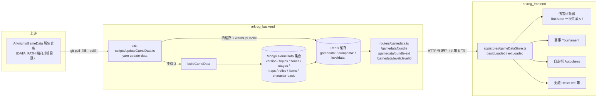

# 游戏数据管线与上游更新 Runbook

本文描述从 ArknightsGameData 解包仓库到前端各消费模块的完整数据链路，以及"上游更新后如何把新数据安全推到前端"的操作步骤。链路跨两个仓库：后端段在 `arkrog_backend`（与本仓库同级目录），前端段在本仓库。游戏名词以[术语表](glossary.md)为准。

> ⚠️ 安全约定：本文及任何文档只允许出现环境变量**名**（`DATA_PATH`、`MONGO_URI`、`ACTIVE_CHARS` 等），严禁把 `.env` 的实际值写入文档或提交记录。

> 🚨 **链路断裂与修复（2026-07-18 状态更新）**：本文所述管线中"记录 → stage-preview 重算"与"stage-enemies 重建"两段的写路径曾整体断裂。**断裂存在于后端 `fc2f75f`（2025-11-14）~ `790afd6`（2026-07-13）区间；生产后端已于 2026-07-18 部署至 `65961b7`，并完成 `Data.stage-preview` / `Data.stage-enemies` 全量回填。** 四处断裂一句话摘要：
>
> 1. `fc2f75f` 删除 `dataCacheManager` 公有 `get`/`set` 后调用点未迁移——stage-preview 增量重算（提交/删除记录触发）100% TypeError 且被 `.catch(console.error)` 吞掉，admin 全量重算必 500；
> 2. `stageEnemies.js` 仍从已迁移的旧位置 import `processLevelData`——`updateGameData.ts` 整体无法启动（本文第 3 节脚本在该区间不可用）；
> 3. `processLevelData` 已改为 async 而调用点未 await；
> 4. `loadAppDataFromSource` 把 `camelToKebab` 函数当映射表做下标访问，结果恒为 undefined。
>
> `790afd6` 修复以上四处（`DataCacheManager` 补公有 `set`、`stagePreviewSingleUpdate` 改用 `getOrLoadAppData` 读取且单关更新时重建面包屑、`stageEnemies.js` 改从 `#utils/gamedata/level.js` 导入并补 await、修正 `camelToKebab` 下标误用）。部署修复后需回填断裂期间未更新的数据：L4 管理员 `POST /admin/calculate-stage-preview` 回填 `Data.stage-preview`，跑 `util-scripts/updateGameData.ts` 重建 `Data.stage-enemies`——完整部署与回填顺序见[无藏运维手册](../app/modules/RelicFree/docs/07-ops-runbook.md)，缺陷登记见[无藏 known-issues](../app/modules/RelicFree/docs/known-issues.md)。

## 1. 端到端链路图



链路要点（细节见后续小节）：

1. **解包仓库**是唯一上游。后端通过环境变量 `DATA_PATH` 直接读其 `zh_CN/gamedata/` 下的 excel/levels 文件。
2. **一键更新脚本** `arkrog_backend/util-scripts/updateGameData.ts`（`yarn update-data`）按固定顺序：清缓存 → `buildGameData` 重建 Mongo → 重建关卡预览类数据 → `warmUpCache` 预热 Redis。脚本与运行中的服务共享同一 Redis，预热完成即对线上生效，**主服务通常无需重启**（改 `.env` 的情况见第 4 节）。
3. **API 层** `arkrog_backend/routers/gamedata.ts` 从 `dataCacheManager`（Redis 优先，Redis 不可用时降级进程内存）读数据，并对响应加 HTTP 强缓存头——这是前端感知更新的最大障碍（第 5 节）。
4. **前端** `app/stores/gameDataStore.ts` 的 `useGameDataStore` 拉取并缓存原始数据；伤害计算器在进入 `/tool` 路由时由 `app/modules/Tool/index.tsx` 并行调用 `fetchGameDataBasic` 与 `fetchGameDataExt`，完成后把整个 store 传入 calculatorSlice 的 `initStore` 做一次性预处理。

## 2. 各环节的数据形态

### 2.1 Mongo：GameData 集合（buildGameData 产出）

`arkrog_backend/utils/gamedata/buildGameData.js` 的 `buildGameData` 读取解包文件（`roguelike_topic_table` 等），裁剪重组后逐文档 upsert 进 Mongo 的 `GameData` 集合，每个文档形如 `{ name, data, date_updated }`：

| 文档 name | 内容 | 主要消费方 |
|---|---|---|
| `version` | `data_version.txt` 中的日期 + VersionControl 串 | **目前无任何端点消费**（见第 5 节缺口） |
| `topics` | 各肉鸽主题基本信息（含手工维护的 `name_en`） | bundle |
| `zones` | 各主题层数据 | bundle |
| `stages` | 各主题关卡（含构建期生成的 `stageName`、`mainEnemy`） | bundle |
| `traps` | 支援道具 | （前端 bundle 暂未取用） |
| `relics` | 藏品表（含拼音索引；通宝也在其中，靠 id 含 `copper` 区分） | bundle-ext |
| `items` | 物品表 | bundle-ext |
| `character-basic` | 干员基本信息 + 模组展示信息 | 非计算器场景 |

注意 `character-raw-bundle`（计算器用的 `character_table`/`skill_table`/`uniequip_table`）**不入 Mongo**：它由 `arkrog_backend/utils/gamedata/buildCharacterRawBundle.js` 的 `buildCharacterRawBundle` 在缓存未命中时即时构建，结果只存 Redis（键 `gamedata:characterRawBundle`），并按 `ACTIVE_CHARS` 白名单裁剪（第 4 节）。

另外两类产物由脚本的第 5、6 步写入 `Data` 集合：`stage-enemies`（关卡敌人预览）与 `stage-preview`（关卡预览，依赖用户记录，可 `--skip-preview` 跳过），服务于无藏收录等展示场景——生产/存储/下发的正文在无藏模块内，本文只做路由（见第 2.5 节）。

### 2.2 Redis：dataCacheManager 三类前缀

`arkrog_backend/utils/dataCache.js` 的 `dataCacheManager` 是所有读路径的必经层：

| 前缀 | 内容 | 生存期 |
|---|---|---|
| `gamedata:{camelCase}` | GameData 集合各文档 + `characterRawBundle`/`autochess` 两个特殊键 | 永久（仅靠手动清除/更新脚本清除） |
| `dumpdata:{文件名}` | 解包 excel 原始 JSON（`character_table` 等） | 24 小时 TTL |
| `leveldata:{关卡后缀}` | 单关详细数据（`processLevelData` 产物） | 3 天 TTL |

实际 Redis 键还带 `REDIS_PREFIX`（默认 `arkrog`）前缀。Redis 可用时进程内存缓存不参与；Redis 不可用时才降级到内存缓存——因此**清了 Redis 就等于清了服务端缓存**，这是更新脚本即时生效的原理。

### 2.3 HTTP 端点与缓存头

`arkrog_backend/routers/gamedata.ts`、`routers/relic-free.js` 与 `routers/appData.js` 注册的前端数据端点，缓存头由 `arkrog_backend/middleware/optimization.js` 的 `strongCacheMiddleware` 统一下发（`/relic-free/stage-preview` 刻意不挂该中间件，见表内说明）：

| 端点 | 返回内容 | Cache-Control |
|---|---|---|
| `GET /gamedata/bundle` | `topics` + `zones` + `stages` | `public, max-age=86400`（24 小时强缓存） |
| `GET /gamedata/bundle-ext` | `relics` + `items` + `character_table`/`skill_table`/`uniequip_table` | `public, max-age=86400`（24 小时强缓存） |
| `GET /gamedata/level/:levelId` | 单关详细数据（敌人面板） | `public, max-age=31536000`（**一年**强缓存） |
| `GET /gamedata/character-raw` | 同 bundle-ext 的干员三表 | `no-cache`（每次条件验证） |
| `GET /gamedata/autochess` | 自走棋数据 | `no-cache`（开发期临时设置） |
| `GET /relic-free/bundle` | `character_basic` + `stageEnemies`（无藏，`stagePreview` 不在其中） | `public, max-age=86400`（24 小时强缓存） |
| `GET /relic-free/stage-preview` | `stagePreview`（用户记录派生的关卡预览） | **无缓存头**（不经 `strongCacheMiddleware`，浏览器每次回源）——与 bundle 的不对称是设计而非疏漏，理由见第 2.5 节链接的模块正文 |
| `GET /app/bundle` | `inclusionPrinciple`/`recommendRecordIds`/`latestRecordIds`/`charImages` 等站内数据 | `public, max-age=3600`（1 小时强缓存） |

`strongCacheMiddleware` 还会包装 `res.send`，给响应体算 SHA-256 哈希前 8 位作为 ETag 并处理 `If-None-Match` 304。`level/:levelId` 路由内虽显式写入 `ETag = levelId`，但常规请求下会被该包装用内容哈希覆盖；仅当请求头带 `Cache-Control: no-cache`（中间件整体跳过）时 `levelId` 才会作为 ETag 发出。无论哪种 ETag，在一年强缓存内浏览器根本不发起再验证，ETag 实际不起作用——后果见第 5 节。

### 2.4 前端拉取

- 请求封装：`app/utils/tools.ts` 的 `_get`——`fetch(VITE_API_BASE_URL + url, { credentials: "include" })`，**不带任何 cache 选项、不加版本参数**，完全跟随浏览器 HTTP 缓存。
- store：`app/stores/gameDataStore.ts` 的 `useGameDataStore`，三个 action：
  - `fetchGameDataBasic` → `/gamedata/bundle`，成功后置 `basicLoaded = true`；
  - `fetchGameDataExt` → `/gamedata/bundle-ext`，成功后置 `extLoaded = true` 并返回整个 store 状态；
  - `fetchAutochessData` → `/gamedata/autochess`（走 `app/services/api` 的 axios 实例而非 `_get`）。
  
  `basicLoaded`/`extLoaded` 是**会话内防重复请求标志**：已加载则直接返回，不存在任何"重新拉取"机制。
- 计算器入口：`app/modules/Tool/index.tsx` 在挂载时 `Promise.all` 两个 fetch，再把结果灌入 calculatorSlice 的 `initStore`（store 架构详见模块文档 [01-architecture](../app/modules/Tool/DamageCalculator/docs/01-architecture.md)）。
- 关卡懒加载：`app/stores/damageCalculator/calcUtils/gameDataUtils.ts` 的 `loadLevelData` 按需请求 `/gamedata/level/{levelId}`，请求前把 levelId 转小写并把 `/` 替换为 `&&`（后端路由再还原），返回时合并同名同面板敌人；结果缓存在计算器 store 的 `levels` 字段（仅内存，刷新即失）。

### 2.5 无藏收录专有链路（正文在模块内）

`stage-preview`（用户记录派生的关卡预览，整条管线里**唯一混入用户数据的产物**）与 `stage-enemies`（关卡敌人名称表）两份 `Data` 集合产物，以及 `/relic-free/*`、`/app/bundle` 端点族的下发口径、bundle 强缓存 vs stage-preview 无缓存的不对称设计、stage-preview 增量/全量双生产路径与外部素材依赖，正文统一在[无藏模块 06-data-pipeline](../app/modules/RelicFree/docs/06-data-pipeline.md)；重算/回填/危险端点等运维操作见[无藏模块 07-ops-runbook](../app/modules/RelicFree/docs/07-ops-runbook.md)。本文只保留上表的缓存行为登记与文首的断裂勘误警示块，不展开。

## 3. 后端操作步骤：一键更新脚本

以下转述自 `arkrog_backend/util-scripts/updateGameData.ts` 头部注释块——**该注释是后端更新流程的权威来源**，本节与其冲突时以脚本注释为准。

### 3.1 用法

在 `arkrog_backend` 目录下执行：

```bash
yarn update-data                                  # 开发库（NODE_ENV=development）
yarn update-data:prod --yes                       # 生产库（NODE_ENV=production，必须 --yes）
npx tsx util-scripts/updateGameData.ts --pull     # 先 git pull 上游仓库再重建
npx tsx util-scripts/updateGameData.ts --skip-preview  # 跳过 stage-preview 重建
```

| flag | 作用 |
|---|---|
| `--pull` | 执行前先在 `DATA_PATH` 中 `git pull --ff-only` |
| `--skip-preview` | 跳过 stage-preview 重建（该数据还依赖用户记录，非纯上游数据） |
| `--yes` / `-y` | `NODE_ENV=production` 下确认写入生产库，**必须显式提供**，否则脚本直接报错退出 |
| `--help` / `-h` | 显示帮助 |

### 3.2 前置要求

1. 依赖已安装且**包含 devDependencies**——`buildGameData` 依赖 devDependency `tiny-pinyin`，用 `--production` 安装会报模块缺失。
2. MongoDB 已启动且可连接。
3. Redis 已启动且可连接（脚本会清理并预热缓存，连不上直接报错退出）。
4. `DATA_PATH` 指向有效的 ArknightsGameData 解包仓库，须包含 `zh_CN/gamedata/excel/data_version.txt`、`zh_CN/gamedata/levels/`、`zh_CN/gamedata/levels/enemydata/enemy_database.json`（脚本会预检并给出清晰报错）。
5. 在 `arkrog_backend` 目录下运行。

### 3.3 环境变量

脚本自动加载 `.env` 与 `.env.<NODE_ENV>` 两个文件，shell/pm2 中已设置的值**优先**于 `.env` 文件：

| 变量名 | 说明 |
|---|---|
| `NODE_ENV` | `development` \| `production`（默认 development） |
| `DATA_PATH` | **必填**，解包仓库根目录 |
| `MONGO_URI` | `NODE_ENV=development` 时必填 |
| `MONGO_URI_PROD` | `NODE_ENV=production` 时必填 |
| `REDIS_URI` / `REDIS_PORT` / `REDIS_DB` / `REDIS_PASSWORD` / `REDIS_PREFIX` | Redis 连接（默认 localhost:6379 db0 / 前缀 `arkrog`，前缀需与主服务一致）。**在 dev 目录执行时见下方警示块** |
| `ACTIVE_CHARS` | 计算器干员白名单（见第 4 节，更新脚本本身不读它，但其 `warmUpCache` 触发的 `buildCharacterRawBundle` 会读） |

### 3.4 执行步骤与顺序约束

脚本按以下 7 步执行，**缓存清理/预热顺序是刻意设计的，勿改动次序**（脚本头注释原话）：

| 步骤 | 动作 | 为什么在这个位置 |
|---|---|---|
| 1 | （可选 `--pull`）`git pull --ff-only` | 后续一切都读解包文件，必须最先更新 |
| 2 | 清 `dumpdata:` / `leveldata:` 缓存 | `buildGameData` 内部的 `processLevelData` 及后续步骤经 `dataCacheManager` 读解包数据，不先清空会用旧缓存（`dumpdata:` 有 24h TTL，更新当天大概率仍命中旧值） |
| 3 | `buildGameData()` | 重建 GameData 集合：version/topics/zones/stages/traps/relics/items/character-basic |
| 4 | 清 `gamedata:` 缓存 | 第 5、6 步要读取**最新的** stages 等数据；同时让旧的 `characterRawBundle` 失效 |
| 5 | `stageEnemiesUpdate()` | 重建 `Data.stage-enemies`（敌人预览） |
| 6 | `stagePreviewFullUpdate()` | 重建 `Data.stage-preview`（可 `--skip-preview` 跳过） |
| 7 | `warmUpCache()` | 重新预热全部缓存；脚本与运行中的服务共享同一 Redis，**执行完即对线上生效** |

每步有 `[n/7] ... done (耗时)` 日志；任何一步失败脚本以非零码退出并打印 `[ERROR]`。

### 3.5 在服务器上执行：必须跑两遍（核实于 2026-08-11）

线上 prod 与 dev 共用同一个 Mongo `arkrog` 库，只靠 `REDIS_PREFIX` 隔离缓存（机制见[部署与环境矩阵](deployment-env-matrix.md) 第 4 节）。因此**数据只需写一遍 Mongo，但缓存要刷两个前缀**，标准动作是两条命令：

```bash
cd /arkrog/prod/backend && yarn update-data:prod --yes                  # 走完七步，刷 arkrog:*
cd /arkrog/dev/backend  && yarn update-data:prod --yes --skip-preview   # 只刷 arkrog-dev:*
```

第二遍加 `--skip-preview`：Mongo 的 `Data.stage-preview` 已被第一遍写好，这遍只为让 dev 前缀的缓存失效并预热，跳过全量重算省一半时间。两遍各约 2 分钟，主服务都无需重启。

> ⚠️ **dev 那遍也必须用 `update-data:prod`。** `REDIS_PREFIX=arkrog-dev` 只写在 dev 后端的 `.env.production` 里，而 `yarn update-data` 是 `NODE_ENV=development`、不会加载该文件——前缀会回落成默认 `arkrog`，**清掉并预热的是生产缓存，dev 缓存反而一直是旧的**。注意 dev 主服务进程本身跑的是 `NODE_ENV=production`（pm2 注入），"在 dev 目录就该用 dev 环境"这个直觉在这里是错的。

上游解包仓库在 **`/arkrog/shared/ArknightsGameData`**（prod/dev 共用一份，三份 `.env` 的 `DATA_PATH` 均指向它），是 `--depth=1` 浅克隆。手动更新时注意：若用 `git fetch --depth=1` 拉取，嫁接点会断开导致 `git merge --ff-only` 报 `refusing to merge unrelated histories`，需用 `git reset --hard FETCH_HEAD` 落地（该仓库是纯上游镜像、无本地提交，此语义安全）；脚本的 `--pull` 走的是普通 `git pull --ff-only`，不受此影响。服务器直连 GitHub 仅 23KB/s，走 mihomo 代理 `127.0.0.1:7890` 约 1.9MB/s。

> 把这套动作自动化（cron + 变更水位 + 新主题闸门）的设计见[解包数据自动同步设计](gamedata-auto-sync-plan.md)，**规划中、尚未实施**；在它落地前，上游同步全靠人工执行本节命令。

## 4. 新干员上架

干员能否出现在伤害计算器里由**后端白名单**控制：`arkrog_backend/utils/gamedata/buildCharacterRawBundle.js` 的 `cutCharacterRawBundle` 读取环境变量 `ACTIVE_CHARS`（以 `|` 分隔的干员**中文名**），只把名字命中且 `profession !== "TOKEN"` 的干员及其技能表、模组表放进 character-raw-bundle。

前端侧不再做名单过滤：calculatorSlice 的 `initStore` 中按 charImpl 文件名过滤的旧逻辑已被注释，现行 `allowCharNames` 恒等于后端发来的全量名单，只额外剔除 TOKEN/TRAP——**看前端代码容易误以为干员上架由前端控制，实际开关在后端 `.env`**。

上架步骤：

1. 编辑后端 `.env` 中的 `ACTIVE_CHARS`，追加干员中文名（名字必须与 `character_table` 中 `name` 字段完全一致）。
2. 让旧的 character-raw-bundle 缓存失效。推荐直接重跑 `yarn update-data`：脚本进程会加载新 `.env`，第 4 步清掉 `gamedata:` 缓存，第 7 步 `warmUpCache` 用新白名单重建 bundle 写入共享 Redis，主服务无需重启。
3. 前端为该干员编写 charImpl 实现并注册，详见 [04-char-impl-cookbook](../app/modules/Tool/DamageCalculator/docs/04-char-impl-cookbook.md)。

> ⚠️ **只改 `.env` 然后重启主服务是不够的**：`gamedata:characterRawBundle` 是 Redis 永久缓存，重启后服务依然从 Redis 读到按旧白名单裁剪的 bundle。必须清掉该 Redis 键（重跑 `yarn update-data` 即可，它的第 4 步会清 `gamedata:*`）。反过来，只重跑脚本而不重启主服务是可以的——主服务每次请求都查 Redis，没有进程内缓存挡在前面（Redis 可用时）。

## 5. 前端感知与缓存陷阱

> ⚠️ **服务端更新成功 ≠ 用户看到新数据。** 第 2.3 节的 HTTP 强缓存意味着：`updateGameData` 只刷新服务端 Mongo/Redis，**没有任何机制使已发出的浏览器缓存失效**。具体后果：
>
> - `bundle` / `bundle-ext`：用户浏览器在上次请求后的 **24 小时**内根本不会向服务器发请求，新藏品/新干员最长延迟一天才被普通用户看到。
> - `level/:levelId`：**一年**强缓存。上游对已有关卡的敌人数值调整，老用户在自然状态下几乎永远拿不到——目前没有任何运营侧手段触达，只能依赖用户自己硬刷新或换无痕窗口。
> - 前端 `_get` 不加版本参数、不设 fetch cache 选项，没有 cache-busting。
> - **没有数据版本可观测性**：`buildGameData` 把解包版本串写进了 Mongo `GameData` 集合的 `version` 文档，但 `arkrog_backend/routers` 下没有任何端点读取它，前端也没有任何版本展示。"数据更新是否成功到达前端"目前只能靠肉眼对比。该缺口待立 ADR 决定是否新增版本端点与前端展示（见[计划](damage-calculator-doc-plan.md)第五节）。

### 如何确认新数据已到前端（现实操作）

1. 用**无痕窗口**打开站点 `/tool` 页；或在 DevTools → Network 勾选 **Disable cache** 后刷新。勾选后请求携带 `Cache-Control: no-cache`，浏览器跳过本地缓存，且 `strongCacheMiddleware` 对这类请求直接跳过、不再下发强缓存头。
2. 在 DevTools Network 中找到 `bundle-ext` 响应，在响应体里搜索新藏品/新干员的 id 或名字，确认后端已返回。
3. 页面检查点：
   - **新藏品**：打开藏品选择器，新藏品**出现但置灰** = 数据已到、独立黑板尚未注册（`initStore` 会把 buff 未在表达式树留下节点的藏品标记 `disabled`，适配方法见 [03-relic-adaptation-guide](../app/modules/Tool/DamageCalculator/docs/03-relic-adaptation-guide.md)）；**完全不出现** = 数据未到（缓存）或后端构建失败。
   - **新干员**：干员选择器中应能搜到；搜不到优先排查 `ACTIVE_CHARS` 拼写与 Redis 旧缓存（第 4 节警示块），其次才是浏览器缓存。
4. 关卡敌人数值类变更无页面级感知手段，只能在无痕窗口选中对应关卡，对照解包数据核对敌人面板。

## 6. 模块适配：上游变更类型 → 动作

数据到达前端只是第一步，多数变更还需要前端代码适配。各类变更的正文手册在模块文档内，本节只做路由：

| 上游变更 | 后端动作 | 前端动作 | 正文 |
|---|---|---|---|
| 新增藏品/通宝 | `yarn update-data`（relics/items 自动入库） | 决定走通用黑板或注册独立黑板；维护各手工名单；未注册前自动置灰 | [03-relic-adaptation-guide](../app/modules/Tool/DamageCalculator/docs/03-relic-adaptation-guide.md) |
| 新增干员 | `ACTIVE_CHARS` 加名 + `yarn update-data` | 新建 charImpl 实现并注册 | [04-char-impl-cookbook](../app/modules/Tool/DamageCalculator/docs/04-char-impl-cookbook.md)，后端段见本文第 4 节 |
| 新增肉鸽主题 | `yarn update-data` 自动入库 topics；`buildGameData` 内 `names_en` 等硬编码数组需手工补一项 | 计算器侧与无藏侧各有 10+ 文件散点改动 | 计算器侧 [new-topic-checklist](../app/modules/Tool/DamageCalculator/docs/new-topic-checklist.md)；无藏侧 [new-topic-checklist](../app/modules/RelicFree/docs/new-topic-checklist.md) |
| 岁时/天象、年代、灵感数值调整 | 无（这些数值不走数据管线） | 手改前端硬编码（WRATH_CONFIG、disasters/fragments 等） | [05-topic-spec-and-enemy-spec](../app/modules/Tool/DamageCalculator/docs/05-topic-spec-and-enemy-spec.md) |
| 关卡增删、关卡命名模式变化、敌人数值调整 | `yarn update-data` | 核对关卡相关硬编码（无效关卡过滤、带船关、合并特例等） | [version-sensitive-hardcode](../app/modules/Tool/DamageCalculator/docs/version-sensitive-hardcode.md) |

岁时/年代/灵感一行值得展开一句：这三类数值**完全硬编码在前端组件目录**，不经过本文描述的任何管线——上游平衡性调整时跑遍后端流程也不会有任何变化，必须人工对照解包数据修改，这是数据更新时最容易遗漏的一类。

## 7. 验证

数据更新与适配完成后的验证手段（现状：自动验证尚未建成，现有测试套件全红，原因与重建方案见下列文档）：

- 夹具生成与金值基线：[09-fixtures-and-baselines](../app/modules/Tool/DamageCalculator/docs/09-fixtures-and-baselines.md)
- 新增藏品 buff 量自动验证设计：[10-relic-buff-verification](../app/modules/Tool/DamageCalculator/docs/10-relic-buff-verification.md)
- 测试命令与工程环境：[testing.md](testing.md)

当前现实可用的验证是：无痕窗口打开 `/tool`，选干员/藏品/关卡，对照伤害加成面板手工核对（页面上"请结合伤害加成面板进行数据验证"的提示即指此）。

## 8. 一次完整数据更新的端到端 Checklist

### 后端（在 arkrog_backend 机器/目录）

- [ ] 1. 更新解包仓库：在 `DATA_PATH` 目录 `git pull`（或下一步加 `--pull`）。
- [ ] 2. 确认环境：Mongo 与 Redis 在线；依赖含 devDependencies（`tiny-pinyin`）；`DATA_PATH` 结构通过脚本预检。
- [ ] 3. 若涉及新干员：编辑 `.env` 的 `ACTIVE_CHARS`（`|` 分隔中文名，须与 `character_table` 的 `name` 完全一致）。
- [ ] 4. 执行 `yarn update-data`（生产：`yarn update-data:prod --yes`）。
- [ ] 5. 确认 7 步日志全部 `done`、无 `[ERROR]`；改过 `.env` 的话确认第 7 步已重建 characterRawBundle（脚本会打印"伤害计算器可用干员"名单）。

### 前端（本仓库 + 浏览器）

- [ ] 1. 无痕窗口或 DevTools Disable cache 打开 `/tool`，按第 5 节检查点确认新数据已到（新藏品出现/置灰状态、新干员可搜到）。
- [ ] 2. 完成代码适配：藏品/通宝 → [03](../app/modules/Tool/DamageCalculator/docs/03-relic-adaptation-guide.md)；干员 → [04](../app/modules/Tool/DamageCalculator/docs/04-char-impl-cookbook.md)；新主题 → [new-topic-checklist](../app/modules/Tool/DamageCalculator/docs/new-topic-checklist.md)。
- [ ] 3. 逐项核对[版本敏感硬编码清单](../app/modules/Tool/DamageCalculator/docs/version-sensitive-hardcode.md)（含岁时/年代/灵感硬编码、关卡特例、主题切片等）。
- [ ] 4. 验证：按 [09](../app/modules/Tool/DamageCalculator/docs/09-fixtures-and-baselines.md)/[10](../app/modules/Tool/DamageCalculator/docs/10-relic-buff-verification.md) 流程跑验证，并在 `/tool` 页对照伤害加成面板手工抽查。

> ⚠️ 提醒：即使以上全部完成，普通用户仍要等最多 24 小时（bundle/bundle-ext 缓存）才能看到新数据；已有关卡的敌人数值变更则受一年缓存影响，老用户基本无法自然获得（第 5 节）。
